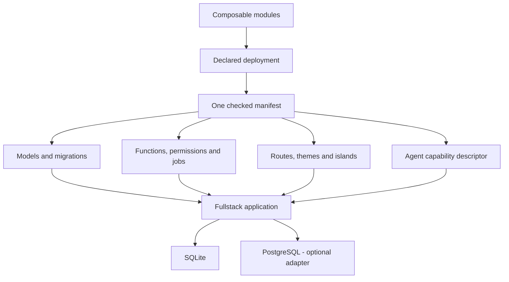
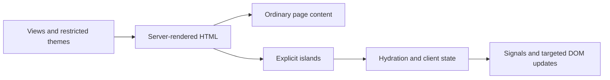

# KetJS

**Build modular fullstack applications. Keep the contracts explicit.**

KetJS brings your data model, business operations, web UI, background jobs, and agent capabilities
into one composed application. Start with SQLite, add PostgreSQL when you need it, and reuse the
same modules across multiple deployments.

Server-rendered pages. Reactive islands. Durable workflows. A small dependency surface.

**[Get started](#get-started)** · [Create a static site](#static-site) ·
[View packages](#a-small-core-optional-adapters)

> [!WARNING]
> **KetJS 0.x is preview software.** APIs, data formats, CLI behavior, and deployment assumptions
> may change without notice. Do not use it for production workloads yet.

## Compose your application from modules

A module declares what it owns, what it depends on, and where other modules can extend it.
Add a feature by composing modules: extend a published model, fill a UI extension point, declare a
function, or enqueue a job. Missing dependencies and unpublished extension points fail composition,
so incompatible combinations are caught before the application serves requests.

One workspace can ship several deployments, each with its own immutable module selection. Share
common features while keeping each deployment's schema, permissions, routes, and workers aligned.



## Business logic with enforceable boundaries

Server functions declare their inputs, permissions, and effects. The runtime checks access to
models, queues, storage, and transports against those declarations. Changesets cast allowed fields
and validate domain data; tenant-aware resolution keeps application data scoped to its owner.

Use the same business operations from HTTP, application code, and exposed agent tools. Functions
can opt into dry runs and idempotency, giving callers a way to inspect a mutation and retry it with
an explicit key.

## Render on the server. Add interaction where it matters.

The ketjs-view layer combines server rendering with signals and targeted DOM updates. Explicit
islands hydrate interactive regions while the rest of the page stays ordinary HTML. Write views
in TypeScript and TSX, reuse browser-safe form schemas, and keep browser state in client runtimes.

Themes combine KTL templates, styles, and browser JavaScript for interactive presentation. KTL's
server expressions read declared data; browser modules own client-side effects. Modules publish
extension points so themes and add-ons can customize the UI through declared contracts.

The view layer also stands on its own: build static sites with HTML, CSS, and JavaScript, using the
same templates and islands without a KetJS server.



## Keep workflows durable

Enqueue jobs in the same transaction as your business data. A separate worker process runs the
committed work using leases and retries, backed by SQLite or PostgreSQL. Redis is not required.

Resume streams from a cursor, store blobs through a tenant-namespaced local or S3-compatible
storage contract, and declare printable documents beside their owning module. KetJS provides
HTML previews and deterministic PDF rendering for those report contracts.

## More of the application, covered

| Capability | What it gives you |
| --- | --- |
| Models, queries, and migrations | A schema derived from the modules your deployment actually ships |
| Native HTTP routes and forms | Web behavior connected to your domain functions and validation contracts |
| Transactional form actions | Shared nested contracts, scoped drafts, revision-aware commands and atomic retry receipts |
| HTTP function bindings and OpenAPI | REST-style operations derived from server functions, checked both ways, with a generated OpenAPI 3.1 document |
| API reference | New applications can build a static [Spec](https://github.com/ketvietlab/ketsuite/tree/develop/packages/ketspec) reference with `npm run api:docs` |
| Sessions, permissions, and tenant isolation | Explicit identity and access boundaries for business operations |
| Agent capability descriptors | Discoverable operations with declared permissions and effects |
| Menus and localization | Module-owned navigation and messages that compose with the application |
| Headless end-to-end testing | Real HTTP calls, session cookies, isolated SQLite data and storage, and worker draining |
| Operational logging | Structured events, log drivers, and redaction rules |
| TypeScript and TSX | Typed authoring with compiled JavaScript for production |

## A small core, optional adapters

The core uses Node built-ins and the separately published ketjs-view package. SQLite uses Node's
built-in driver; the PostgreSQL driver stays in its optional adapter. The browser-safe view package
has no runtime dependencies.

| Package | Use it for |
| --- | --- |
| [`@ketvietlab/ketjs`](packages/ketjs) | Fullstack applications, module composition, data, HTTP, jobs, and CLI |
| [`@ketvietlab/ketjs-view`](packages/ketjs-view) | Signals, templates, DOM updates, server rendering, and islands |
| [`@ketvietlab/ketjs-postgres`](packages/ketjs-postgres) | PostgreSQL support |
| [`@ketvietlab/ketjs-view-tools`](packages/ketjs-view-tools) | Static page building, asset bundling, and development tools |
| [`@ketvietlab/create-view`](packages/create-view) | Static-site scaffolding |

This repository owns these five framework packages. KetSuite, its design system, Flow, and Website
clients live in the KetSuite source and consume KetJS from npm.

## Get started

Requires **Node.js 24 or newer** and npm.

### Fullstack application

```bash
# Run from: /path/to/projects
npx -y @ketvietlab/ketjs@latest new my_app --dir ./my-app
cd my-app
npm install
npm run dev
```

Your application starts at `http://127.0.0.1:3000` with SQLite. Application identifiers start with
a lowercase letter and use lowercase letters, digits, and underscores; directory names may use
hyphens. Keep `@latest` to avoid reusing an older locally installed CLI, or choose an exact version
for a reproducible scaffold.

Already have a project? Install the framework with `npm install @ketvietlab/ketjs`.
Add `@ketvietlab/ketjs-postgres` when you need the PostgreSQL adapter.

### Static site

```bash
# Run from: /path/to/projects
npm create @ketvietlab/view@latest my-site
cd my-site
npm install
npm run dev
```

Build the generated site with `npm run build`; deploy the output in `dist/`.

Website and framework guides: [ketjs.dev](https://ketjs.dev). The site source and local development
instructions are in [packages/docs](packages/docs/README.md).

## Contributing

Read [AGENTS.md](AGENTS.md) for repository boundaries, contribution rules, and local verification
scope. Each package's README describes its public purpose and entry points.

## License

[MIT](LICENSE). Copyright © 2026 KETVIET JSC, Vietnam.
