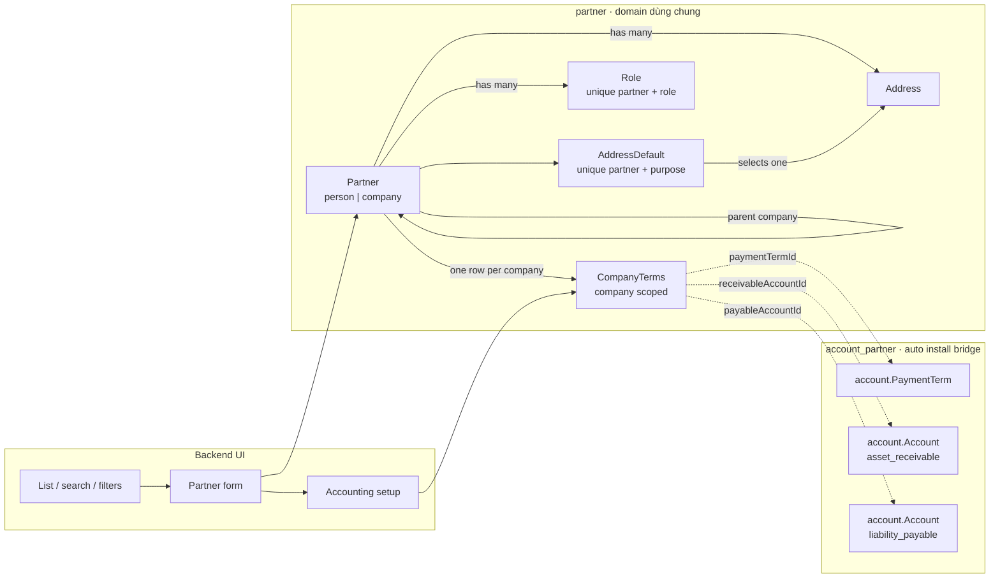
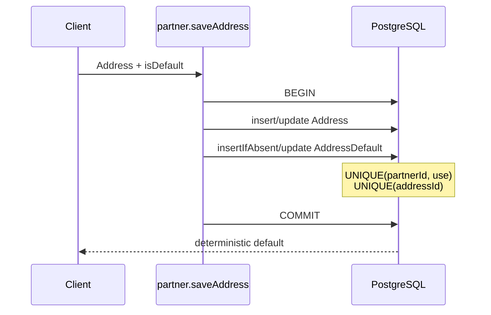

# Partner theo Odoo 19

Tài liệu này mô tả subset Partner được port từ Odoo 19 vào KetSuite, các điểm chủ
đích giữ khác schema Odoo, interface công khai và cách kiểm tra cụm này. Source
chính nằm trong `packages/ketsuite/src/modules/partner`; phần nối kế toán nằm trong
`packages/ketsuite/src/modules/account_partner`.

## Phạm vi

Cụm Partner quản lý:

- cá nhân và tổ chức trong một danh bạ dùng chung tenant;
- cây liên hệ giữa cá nhân và tổ chức;
- nhiều địa chỉ theo mục đích `contact`, `invoice`, `delivery`, `other`;
- vai trò `customer`, `supplier`, `employee`;
- hạn mức tín dụng và ghi chú riêng theo từng company;
- điều khoản thanh toán và tài khoản công nợ khi Accounting được cài;
- giao diện danh sách, tạo mới, chi tiết, archive/restore và thiết lập kế toán.

Country và đơn vị hành chính nay tham chiếu module `address`; `divisionText` và
input text cũ chỉ là fallback tương thích khi catalog của quốc gia chưa được cài.
Email và VAT không bị ép unique. Mail, chatter, activity và cơ chế record rule của
Odoo không thuộc phạm vi này.

## Thiết kế module



`partner`, `partner_backend`, `account_partner` và `account_partner_backend` được
tách riêng để domain không phụ thuộc giao diện hoặc Accounting. Bridge kế toán chỉ
được auto-install khi cả `account` và `partner` có mặt; vì vậy một app không cài
Accounting không nhận thêm field, route hay UI giả.

## Khác biệt có chủ đích với Odoo 19

KetSuite giữ hành vi nghiệp vụ cần thiết nhưng không sao chép nguyên schema
`res.partner`:

| Odoo 19 | KetSuite | Lý do |
|---|---|---|
| Partner đồng thời biểu diễn party và address | `Partner` và `Address` tách rời | Chứng từ luôn trỏ đúng đối tác, không cần suy lại commercial partner từ cây địa chỉ |
| Vai trò thường được suy từ dữ liệu bán/mua | `Role` là các row rõ ràng | Một đối tác có nhiều vai trò; unique constraint bảo vệ khi ghi đồng thời |
| Company-dependent property qua cơ chế property | `CompanyTerms` có scope `company` | Field có type thật và được engine tự giới hạn theo company hiện hành |
| Field kế toán nằm trên partner/property | Module `account_partner` mở rộng `CompanyTerms` | Core Partner không phụ thuộc Accounting |
| Địa chỉ mặc định thường là quan hệ/loại partner | `AddressDefault` là mapping unique | PostgreSQL có thể cưỡng chế một default cho mỗi mục đích |

## Mô hình và bất biến

### Partner

`Partner.kind` chỉ nhận `person` hoặc `company`. `parentId` là quan hệ tổ chức:

- parent phải tồn tại;
- cấm cycle ở mọi độ sâu;
- một person không thể làm parent trực tiếp của company;
- không thể đổi một company đang có company con thành person;
- archive chỉ đổi `active`, không xóa lịch sử.

`name` được trim khi lưu. `vat`, `email`, `ref`, `phone` và `lang` là metadata,
không được dùng làm định danh đăng nhập và không bị ép unique.

### Address và default address

Mỗi Address thuộc đúng một Partner và không được chuyển chủ sau khi tạo. Storage
canonical dùng `street1`, `street2`, `locality`, `postalCode`, `countryId` và
`divisionId`. Policy của Country quyết định các cấp địa giới bắt buộc; Division
phải thuộc catalog đang hoạt động của Country. Khi `isDefault` được chọn, service
ghi mapping `AddressDefault` trong cùng transaction với Address.



ID của mapping mặc định được tạo ổn định từ partner và mục đích. Unique index
`(partnerId, use)` ngăn hai request cạnh tranh tạo hai default; unique `addressId`
ngăn cùng một Address bị dùng làm default cho nhiều mục đích không khớp.

### Role

`Role` có unique index `(partnerId, role)`. `grantRole` dùng `insertIfAbsent`, nên
gọi lặp lại hoặc chạy đồng thời vẫn idempotent. `revokeRole` cũng idempotent và trả
số row thực sự bị gỡ.

### Company terms và Accounting bridge

Core `CompanyTerms` chỉ chứa:

- `creditLimit`;
- `note`.

Unique index `(companyId, partnerId)` bảo đảm mỗi đối tác chỉ có một bộ điều khoản
trong company hiện hành. `account_partner` mở rộng row này bằng reference thật:

- `paymentTermId` tới `account.PaymentTerm`;
- `receivableAccountId` chỉ nhận account type `asset_receivable`;
- `payableAccountId` chỉ nhận account type `liability_payable`.

Các reference được resolve trong company scope hiện hành. Không còn
`paymentTermDays` hoặc mã tài khoản dạng text trong core.

## Interface công khai

Các function domain chính:

| Function | Mục đích |
|---|---|
| `partner.listPartners` / `countPartners` | Tìm kiếm, lọc kind/role, phân trang và tùy chọn gồm archived |
| `partner.getPartner` | Đọc partner cùng addresses, defaults và roles |
| `partner.savePartner` | Tạo/cập nhật partner và kiểm tra cây |
| `partner.archivePartner` | Archive hoặc restore |
| `partner.saveAddress` | Lưu address và chọn default nguyên tử |
| `partner.grantRole` / `revokeRole` | Cấp/gỡ role idempotent |
| `partner.saveTerms` / `getTerms` | Điều khoản core theo active company |
| `account_partner.saveAccountingTerms` / `getAccountingTerms` | Reference Payment Term và control accounts |

Validation nghiệp vụ trả lỗi có cấu trúc:

```json
{
  "ok": false,
  "errors": [
    {
      "field": "parentId",
      "code": "partner.error.parentCycle"
    }
  ]
}
```

UI và HTTP client dùng `code` để dịch qua catalog `vi`/`en`; domain không trả câu
tiếng Việt hardcode.

## Giao diện quản trị

`partner_backend` cung cấp:

- danh sách có search, lọc customer/supplier và tùy chọn hiện archived;
- form tạo Partner;
- màn hình chi tiết với contact, roles, addresses/default và company terms;
- archive/restore;
- trạng thái empty và lỗi validation có dịch.

`account_partner_backend` chỉ thêm hành động và màn hình Accounting setup khi bridge
được cài. Toàn bộ link nội bộ giữ query `lang`, nên người dùng không mất locale khi
đổi màn hình. Giao diện đã được kiểm tra ở desktop 1440×900 và mobile 390×844 bằng
trình duyệt headless thật, cả tiếng Việt và tiếng Anh.

Ảnh kiểm tra hiện nằm tại:

- `docs/screenshots/partner-directory-vi-desktop.png`;
- `docs/screenshots/partner-detail-en-mobile.png`;
- `docs/screenshots/partner-accounting-vi-mobile.png`.

## Kiểm thử thay đổi liên quan

Khi phát triển cụm này, chạy test đúng phần thay đổi theo `AGENT.md`:

```sh
npm run build
node --test .build/test/identity.test.js \
  .build/test/odoo19-partner-e2e.test.js \
  .build/test/ketsuite-i18n.test.js
```

PostgreSQL integration test trong `test/pg-live.test.ts` kiểm tra concurrent default
address, role và company terms. HTTP E2E trong `test/odoo19-partner-e2e.test.ts`
khởi chạy app thật, đăng nhập và đi qua các route Partner. Full suite chỉ chạy trong
CI khi PR được mở vào `develop`.

Benchmark riêng của cụm chạy bằng:

```sh
npm run bench:identity
```

Benchmark phải được thực hiện ngay trước mỗi commit. Đường đổi default address được
đánh giá cùng invariant transaction/unique của nó, không so như một boolean update
không an toàn cạnh tranh.

## Hướng mở rộng

- Company/Branch tiếp tục dùng Partner loại `company` làm pháp nhân đại diện, nhưng
  Branch không được mô hình hóa bằng `Partner.parentId`.
- Sale, Purchase, POS và Accounting tham chiếu Partner/Address/Role qua các interface
  trên thay vì bổ sung field ngược vào core.
- Catalog Country/Division được mở rộng bằng bundle ISO trong cùng module `address`;
  không tạo một module source cho mỗi quốc gia.
