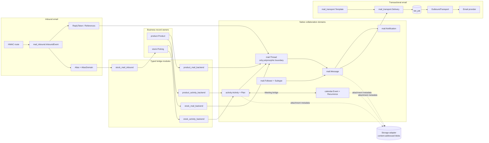
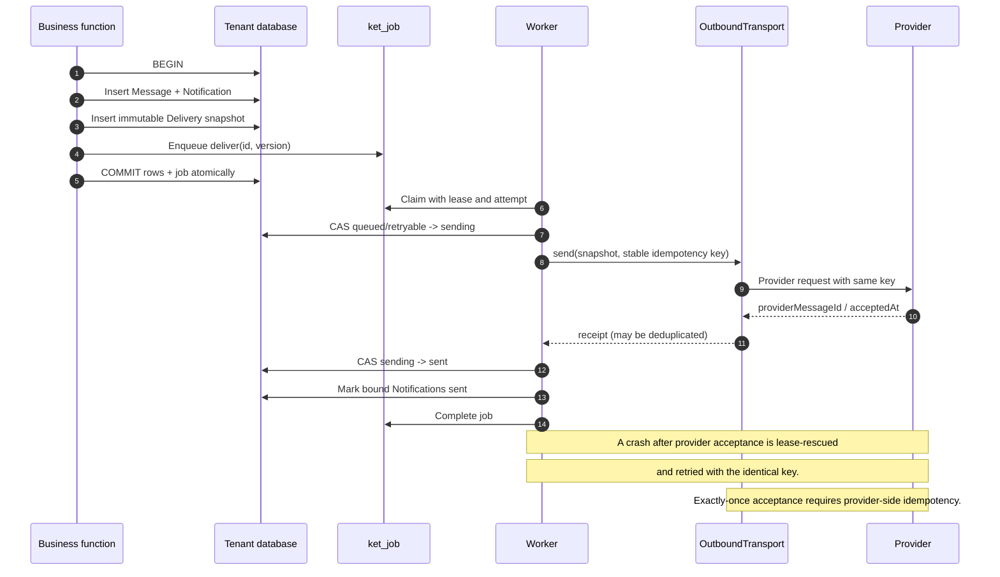
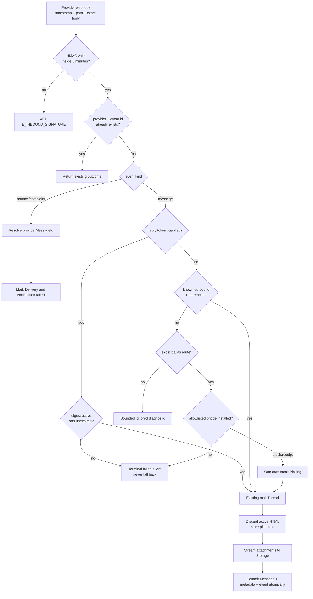
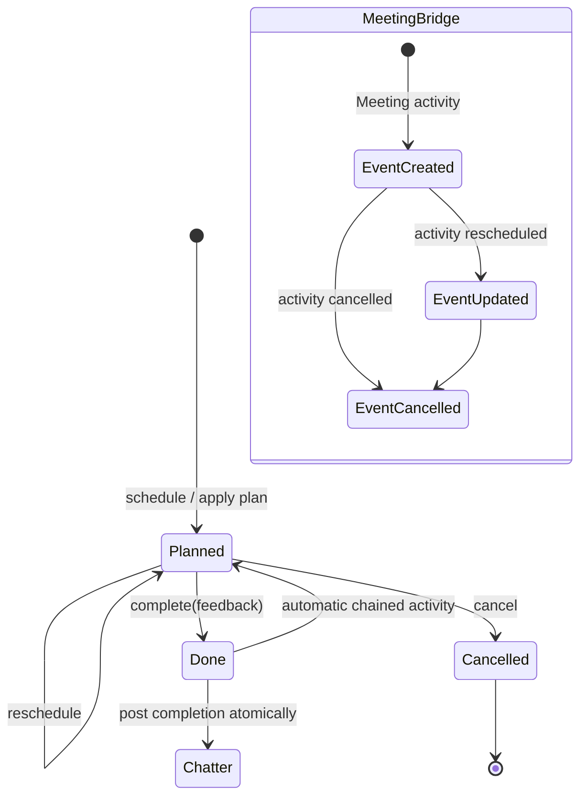

# Odoo collaboration port — implemented design

This is the implementation map for the Odoo 19 Calendar, Chatter, Activity and
Email port. The domain plan is in `06-odoo19-collaboration-port-plan.md`; the
production migration procedure is in `07-odoo-collaboration-cutover.md`.

## 1. Module and authority boundaries

Mail never accepts an arbitrary `model/res_id` read from the public function
surface. Product, Stock and Calendar verify their own records under normal company
scope, then an explicit bridge uses `mail.Thread`. This preserves reusable Chatter
without creating a cross-domain record-rule bypass.

## 2. Durable outbound delivery

`ket_job` owns execution state, leases and retry scheduling; it is not the mail
audit log. Delivery owns the immutable envelope/body snapshot, provider id,
attempt summary and terminal business state. Queue pruning cannot erase the
history shown in Outbox or Chatter.

## 3. Inbound route and alias resolution

The reply-token branch has priority over References: an invalid supplied token is
terminal, so an attacker cannot combine a guessed token with a valid-looking
provider reference. Alias names never become dynamic model names; each supported
bridge is a declared module depending on both domains.

## 4. Activity and Calendar lifecycle

Activity deadlines and all-day Calendar boundaries use the strict `date` scalar.
Timed events store UTC instants plus an IANA timezone. Recurrence expansion is
bounded and exceptions are explicit rows. Reminder jobs carry the Event version,
so jobs left behind by a reschedule or cancellation become safe no-ops.

## 5. Odoo snapshot/delta import and cutover

```mermaid
flowchart LR
  Extract[Bounded normalized Odoo export] --> Preview[previewBatch<br/>read-only validation]
  Blobs[Stream and SHA-256 attachments] --> Preview
  Bindings[Typed partner/user/thread bindings] --> Preview
  Preview --> Gate{errors explained?}
  Gate -- no --> Fix[Repair mapping/export<br/>preview again] --> Preview
  Gate -- yes --> Tx[Atomic importBatch]

  subgraph Transaction[One tenant transaction]
    Tx --> Rows[Upsert deterministic targets]
    Rows --> Maps[Write stable identity maps]
    Maps --> Issues[Persist warnings/errors]
    Issues --> Jobs[Enqueue pending deliveries]
    Jobs --> Cursor[Advance source checkpoint]
  end

  Cursor --> More{Odoo still writable?}
  More -- yes --> Delta[Next strict delta<br/>previousCursor must match] --> Preview
  More -- no --> Reconcile[Count, orphan, timezone<br/>and attachment reconciliation]
  Reconcile --> Cutover[Start Ket workers/webhooks<br/>switch traffic]
  Cutover -. incident before Ket writes .-> Rollback[Read-only rollback manifest<br/>route back to frozen Odoo]
  Cutover -. Ket accepted writes .-> FreezeBoth[Freeze both sides<br/>explicit forward reconciliation]
```

One Odoo source row may map to several explicit Ket targets because the map key
includes `targetModel`; a `calendar.event`, for example, maps both to its typed
Event and its authorized Thread. The importer never treats an Odoo integer as
globally unique, never persists source credentials, strips secret-like alias
defaults and does not re-enqueue sent Odoo mail.

## 6. Verification and evidence

- Domain, failure and HTTP coverage runs under `npm run verify`.
- Warm authenticated render timings run under `npm run bench:collaboration`.
- Chrome headless interaction, readiness timings and screenshots run under
  `npm run e2e:collaboration`.
- PNG evidence and machine-readable browser timings are under
  `docs/assets/odoo-collaboration/`.
- Live MinIO, PostgreSQL and provider sandboxes remain opt-in; an unavailable live
  service is reported as a skip, never replaced by production credentials.
