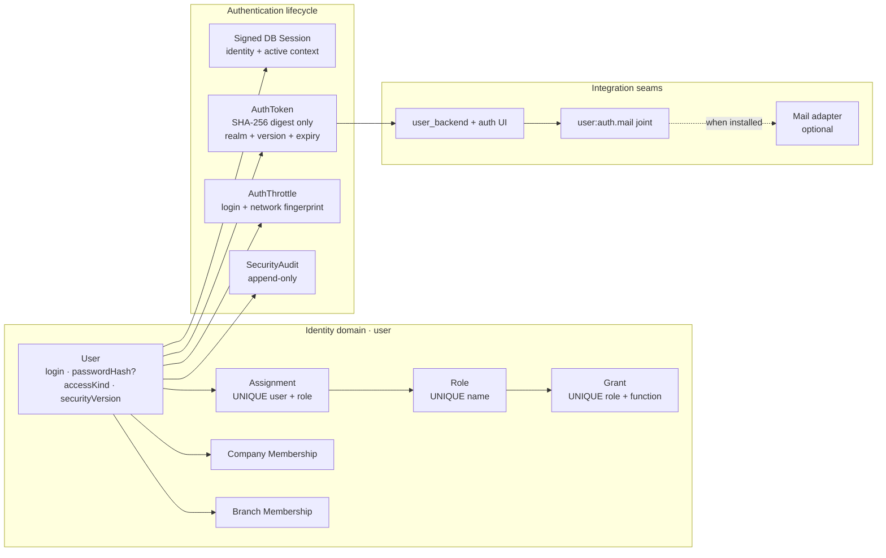
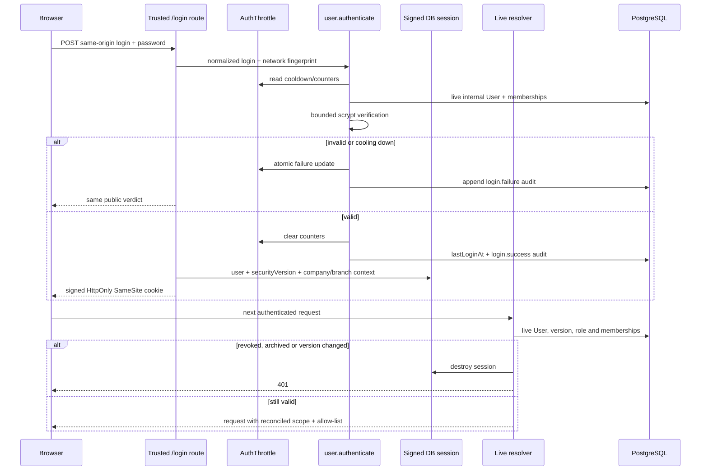
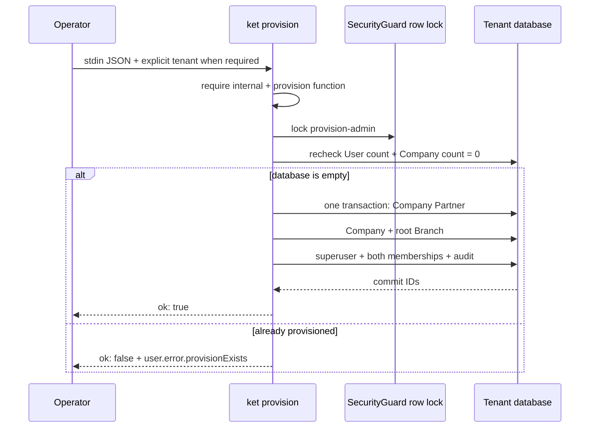

# Authentication và Users theo Odoo 19

Tài liệu này mô tả identity realm nội bộ được port từ Odoo 19 vào KetSuite: User,
Role, session, invitation/reset token, login protection, security audit và UI quản
trị. KetSuite giữ kiến trúc User tách Partner, quyền theo function allow-list và
company/branch scope; không sao chép `_inherits`, `ir.model.access`, record rules
hay implied groups của Odoo.

Source chính:

- `packages/ketsuite/src/modules/user` — domain User, Role và authentication;
- `packages/ketsuite/src/modules/user_backend` — UI quản trị, hồ sơ và token lifecycle;
- `packages/ketjs/src/server/session.ts` và `sessionstore.ts` — session primitives;
- `packages/ketjs/src/server/boot.ts` — live identity/permission resolution;
- `packages/ketsuite/src/ui/auth.tsx` — màn hình nhận invitation/reset trung lập.

## Phạm vi

Cụm này cung cấp:

- tài khoản nội bộ với login chuẩn hóa, password hash nullable và access realm rõ ràng;
- Role/Grant phẳng, cộng dồn theo function, cùng preset User/Manager theo module;
- session được xác thực lại ở mỗi request bằng `securityVersion` và membership live;
- đổi mật khẩu bản thân, thu hồi session và last-superuser guard;
- invitation 144 giờ, reset 4 giờ, token digest-only và single-use bằng CAS;
- PostgreSQL rate limit dùng chung nhiều pod và security audit append-only;
- named Mail integration joint, không tạo SMTP/outbox/template giả;
- bootstrap một lần qua `ket provision user.provisionAdmin`, password chỉ đi qua stdin;
- UI Users, Roles, permission presets, membership, profile, active sessions và token acceptance;
- toàn bộ domain error qua message catalog tiếng Việt/Anh.

Website signup/portal UI, OAuth, API key, passkey, MFA/TOTP, SSO và hạ tầng gửi
mail chưa nằm trong phạm vi. `portal`/`public` đã là access kind hợp lệ nhưng không
được đăng nhập vào backend realm.

## Kiến trúc



## User và credential

`user.User` là identity riêng, chỉ liên kết tùy chọn tới Partner. Các field bảo mật:

| Field | Ý nghĩa |
|---|---|
| `login` | NFKC, trim và lowercase trước mọi lookup; unique ở database |
| `passwordHash` | scrypt có tham số trong chuỗi; nullable khi chờ invitation |
| `accessKind` | `internal`, `portal` hoặc `public`; backend chỉ nhận `internal` |
| `securityVersion` | tăng khi login/password/active/access kind thay đổi |
| `lastLoginAt` | lần đăng nhập backend thành công gần nhất |
| `active` | archive vô hiệu hóa từ request kế tiếp |
| `superuser` | bypass allow-list; luôn bảo vệ superuser hoạt động cuối cùng |

Không function output nào khai báo `passwordHash`, nên projection của engine không
thể trả hash ra HTTP hoặc agent tool ngay cả khi handler vô tình giữ cả row.

Parser scrypt giới hạn `N`, `r`, `p`, kích thước salt/hash và yêu cầu `N` là lũy
thừa của hai trước khi cấp phát. Login không tồn tại vẫn chạy dummy verification
hợp lệ để không tạo đường timing enumeration. Hash cũ được rehash sau login thành
công khi policy thay đổi.

## Login và live session resolution



`user.authenticate`, `user.prepareContext`, `user.resolveSessionContext` và token
consumer là function `internal`; generic function HTTP endpoint và agent descriptor
không công khai chúng. Logged-in user vẫn có thể đi qua trusted route tương ứng,
nhưng không thể gọi thẳng generic endpoint để bỏ qua CSRF, safe redirect, throttle
hoặc session rotation.

Session store có `listUser`, `destroyUser` và `destroyUserExcept`. Đổi mật khẩu bản
thân giữ session hiện tại sau khi rotate credential và đóng các session còn lại;
admin archive/reset đóng tất cả. Logout chỉ nhận POST same-origin.

## Invitation và password reset

```mermaid
sequenceDiagram
  participant Admin
  participant Service as user.issueAuthToken
  participant DB as PostgreSQL
  participant Mail as user:auth.mail joint
  participant User
  participant Accept as /auth/invitation or /auth/reset

  Admin->>Service: user + invitation/reset
  Service->>DB: invalidate previous kind
  Service->>DB: store SHA-256 digest, realm, version, expiry
  alt Mail adapter exists
    Service-->>Mail: raw token once + metadata
    Mail-->>User: delivery owned by Mail team
  else no Mail adapter
    Service-->>Admin: one-time copyable link
  end
  User->>Accept: token + new password
  Accept->>DB: validate digest/realm/version/expiry
  Accept->>Accept: hash new password
  Accept->>DB: CAS consumedAt = null
  alt CAS wins
    Accept->>DB: bump securityVersion + append audit
    Accept-->>User: success; token cannot replay
  else already consumed
    Accept-->>User: stable invalid-token error
  end
```

Chỉ SHA-256 digest được lưu. Invitation hết hạn sau 144 giờ, reset sau 4 giờ theo
subset Odoo 19. Token cùng user/kind thay thế token trước; token gắn auth realm và
`securityVersion`, nên thay đổi credential hoặc trạng thái làm token cũ mất hiệu
lực. CAS nullable dùng `IS NULL`, vì vậy hai pod tiêu thụ đồng thời chỉ có một pod
thắng.

## Rate limit và audit

`AuthThrottle` nằm trong PostgreSQL thay vì memory từng pod. Khóa logic gồm login
đã chuẩn hóa và network fingerprint đã hash; sau ba lần sai, cooldown tăng theo
cấp số nhân. Public response giống nhau cho login không tồn tại, sai mật khẩu và
tài khoản không thuộc backend realm.

`SecurityAudit` ghi login success/failure, password change, reset/invitation,
session revoke và context switch. Audit chỉ chứa event, user/actor, fingerprint,
timestamp và metadata không bí mật; password, raw token và password hash không
được ghi.

## Role, Grant và preset

Quyền tiếp tục là allow-list theo function:

- Role không implied Role khác;
- nhiều Role cộng dồn bằng hợp của Grant;
- `(roleId, fnKey)` và `(userId, roleId)` unique ở PostgreSQL;
- `insertIfAbsent` làm grant/assignment idempotent khi cạnh tranh;
- permission catalogue nhóm function thành `read`, `operate`, `manage` theo module;
- UI chỉ hiển thị module và tác vụ đã dịch, không bắt nhập raw function key;
- preset User/Manager tạo Role/Grant bình thường và vẫn chỉnh sửa được sau đó.

Superuser là escape hatch duy nhất khỏi allow-list. Chỉ superuser được tạo/elevate
superuser khác và không thể archive/hạ quyền superuser hoạt động cuối cùng. Các
mutation có thể làm mất superuser lấy cùng một `SecurityGuard` row lock trong
transaction, nên hai pod vô hiệu hóa hai admin đồng thời vẫn để lại đúng một
superuser hoạt động.

## Provisioning lần đầu

`user.provisionAdmin` là function `internal + provision`; nó không có generic HTTP
endpoint, agent tool hoặc route UI. Chỉ lệnh `ket provision` gọi được function này
với actor hệ thống cố định. JSON đầu vào gồm tên/mã/currency của company và
login/tên/email/password của admin; toàn bộ JSON chỉ được đọc từ stdin bằng
`--input -`, vì vậy password không xuất hiện trong argv hoặc command history.



Hai invocation từ nhiều pod được serialize trên cùng guard row và recheck điều
kiện empty database sau khi lấy lock, nên chỉ một invocation có thể thắng. Mọi row
Partner, Company, Branch, User, membership và audit nằm trong một transaction;
lỗi ở bất kỳ insert muộn nào rollback cả guard row lẫn các row đã tạo. Khi app dùng
tenant databases, CLI từ chối chạy nếu thiếu `--tenant NAME` và chỉ migrate/call
trên adapter của tenant đã chọn.

Ví dụ vận hành:

```sh
printf '%s' '{"companyName":"Ket Viet","companyCode":"KET","currency":"VND","adminLogin":"admin@example.com","adminName":"Administrator","adminEmail":"admin@example.com","adminPassword":"..."}' \
  | ket provision user.provisionAdmin --input -
```

Trong vận hành thật, dùng secret source hoặc prompt để sinh stdin thay vì ghi JSON
literal vào shell history như ví dụ minh họa.

## Interface công khai

### Domain functions

| Function | Exposure | Mục đích |
|---|---|---|
| `user.listUsers` / `getUser` | HTTP | User projection an toàn, membership, role và trạng thái credential |
| `user.createUser` / `saveUser` / `archiveUser` | HTTP | Quản trị lifecycle và security-version rotation |
| `user.listRoles` / `saveRole` | HTTP | Role phẳng |
| `user.grantFunction` / `assignRole` | HTTP | Edge idempotent, concurrency-safe |
| `user.permissionCatalogue` / `applyPreset` | HTTP | UI theo module/tác vụ và preset User/Manager |
| `user.authenticate` | internal | Backend authentication sau trusted `/login` |
| `user.setPassword` | internal | Đổi mật khẩu actor-bound sau trusted profile route |
| `user.issueAuthToken` | internal | Phát hành secret một lần cho admin/Mail joint |
| `user.consumeAuthToken` | internal | Invitation/reset single-use sau trusted auth route |
| `user.resolveSessionContext` | internal | Reconcile live User, version và membership mỗi request |
| `user.recordSecurityEvent` | internal | Append audit từ trusted auth/context routes |
| `user.provisionAdmin` | internal + provision | Bootstrap nguyên tử Company, root Branch và superuser đầu tiên |

### Engine/session primitives

- anonymous/internal functions vẫn gọi được từ trusted route khi browser đã login;
- generic endpoint trả `E_FUNCTION_INTERNAL` cho internal function;
- compare-and-set hỗ trợ expected nullable bằng SQL `IS NULL`;
- session store liệt kê/thu hồi theo User trên memory và PostgreSQL;
- session credential version được rotate nguyên tử.

### Mail joint

Joint `user:auth.mail` nhận `userId`, `kind`, raw `token` và `expiresAt`. Core không
biết schema, endpoint, SMTP, outbox hoặc template của Mail team. Khi chưa có fill,
UI nói rõ integration chưa tồn tại và chỉ cho admin sao chép link một lần.

## Giao diện quản trị

Module `user_backend` cung cấp:

- `/admin/users` và form create/detail;
- company/branch/role membership management;
- invitation/reset action và one-time link state;
- active session list và revoke action;
- `/admin/roles`, form Role và permission groups;
- `/admin/permission-presets`;
- `/admin/profile` với credential change và session list;
- `/auth/invitation` và `/auth/reset` ở auth shell riêng.

Menu/action được lọc theo quyền thật. Profile của chính User đi qua actor-bound
trusted route, nên không cần cấp quyền quản trị User chỉ để tự đổi mật khẩu.

Mọi màn hình đã được mở qua HTTP bằng trình duyệt thật ở desktop 1440×1000 và
mobile 390×844, tiếng Việt/Anh. QA bao gồm populated/empty session, validation
error, permission-filtered menu, no-Mail state, keyboard focus, console error và
horizontal overflow. Không có console error hoặc viewport overflow.

Ảnh kiểm tra:

- `docs/screenshots/user/users-desktop-en.jpg`;
- `docs/screenshots/user/user-detail-desktop-vi.jpg`;
- `docs/screenshots/user/role-permissions-desktop-en.jpg`;
- `docs/screenshots/user/profile-mobile-vi.jpg`;
- `docs/screenshots/user/invitation-mobile-vi.jpg`.

## Kiểm thử theo phạm vi

`test/odoo19-user-auth.test.ts` kiểm tra login normalization, backend realm,
actor-bound password, last-superuser guard, token TTL/replacement/CAS, DB throttle,
audit secret hygiene và scrypt bounds. `test/odoo19-user-auth-e2e.test.ts` đi qua
HTTP thật cho admin/profile screens, token acceptance, session rotation và generic
internal-function protection.

`test/pg-live.test.ts` dùng PostgreSQL và hai adapter độc lập để mô phỏng nhiều
pod, kiểm tra unique login/assignment, single-use token và rate-limit counter dưới
concurrency, đồng thời dùng bốn adapter tranh bootstrap để xác nhận chỉ một kết quả
thắng. `test/odoo19-user-provision.test.ts` kiểm tra empty database, second run,
actor, mã i18n và rollback toàn transaction. `test/odoo19-user-provision-cli.test.ts`
kiểm tra stdin secret hygiene, exit code và tenant selection. Engine/session
regressions nằm trong `engine-primitives.test.ts` và `session.test.ts`.

Theo `AGENT.md`, local chỉ chạy test đúng phạm vi thay đổi. Full suite chạy trên CI
khi PR target `develop`.

## Benchmark PostgreSQL

`bench/identity-auth.bench.ts` dựng schema/fixture trước, warm up workload tuần tự,
rồi dùng monotonic clock đo từng operation. Kết quả báo `p50`, `p95` và throughput;
build, migration, seed và password hash lúc tạo fixture không nằm trong mẫu.

Workload chung chạy cùng một harness trên `origin/develop` và code PR:

- authenticated `user.listUsers` call;
- permission resolution;
- live session resolution;
- successful login KDF;
- idempotent existing role assignment.

Workload mới chỉ có ở PR đo tám request cùng tranh một Role membership và bốn
request cùng tiêu thụ một token single-use. Correctness assertion tương ứng nằm ở
PostgreSQL integration test; benchmark tập trung vào latency/throughput.

```sh
KET_BENCH_PG=postgres://... npm run bench:user-auth
```

Baseline dùng `KET_BENCH_KETSUITE_MODULE` trỏ tới bản build sạch của
`origin/develop`, nên hai phía dùng cùng benchmark, Node.js, engine, PostgreSQL và
máy chạy. Benchmark phải chạy lại ngay trước commit; tăng quá 15% p95 hoặc giảm quá
10% throughput phải được tối ưu hoặc giải trình trong PR.
