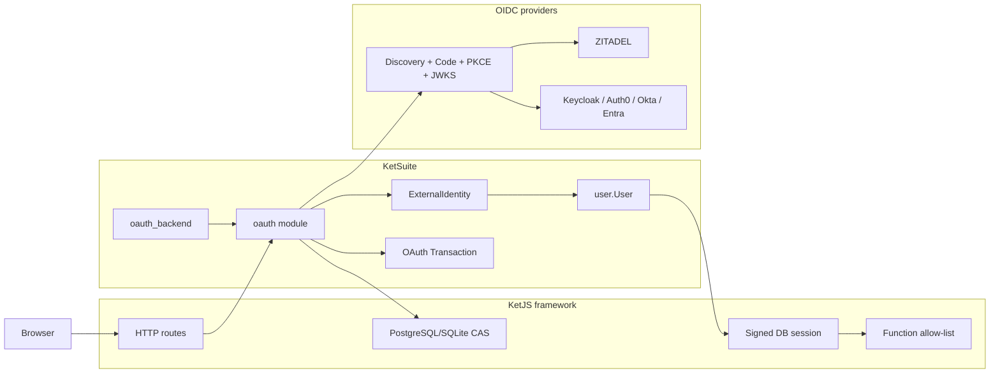
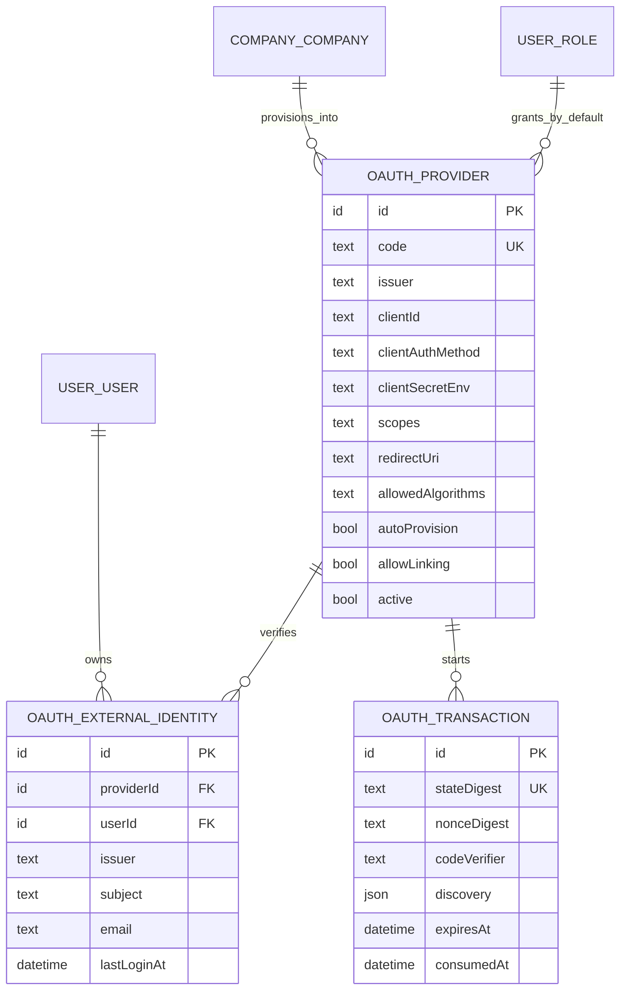

# OAuth/OIDC trong KetSuite

Module `oauth` là phần nguồn mở của **KetSuite**, không phải primitive bắt buộc của
KetJS và không phải adapter riêng của KétViệt. Một ứng dụng xây trực tiếp trên KetJS
có thể chọn hệ thống identity khác; một bản triển khai KetSuite có thể cấu hình
ZITADEL, Keycloak, Auth0, Okta, Entra hoặc OIDC provider tương thích mà không thay
domain User, session hoặc permission.

Source chính:

- `packages/ketsuite/src/modules/oauth` — provider, external identity, transaction
  store, OIDC protocol và trusted routes;
- `packages/ketsuite/src/modules/oauth_backend` — UI quản trị và self-service link;
- `packages/ketsuite/src/modules/user` — local User, live company/branch context và
  session bootstrap;
- `test/oauth-protocol.test.ts`, `oauth.test.ts`, `oauth-e2e.test.ts` — protocol,
  domain concurrency và luồng HTTP qua fake provider ở origin riêng.

## Ranh giới kiến trúc



KetJS chỉ cung cấp transport/runtime đã có: route, signed server-side session,
actor, scope, permission hook, transaction, declarative unique index và CAS. KetJS
không biết issuer, client, JWKS, external subject hoặc chính sách auto-provision.

KétViệt chỉ sở hữu cấu hình triển khai như ZITADEL organization, tenant binding,
host registry hoặc role policy. Các giá trị đó không xuất hiện trong schema và
protocol code của module.

## Mô hình dữ liệu



`(providerId, issuer, subject)` là khóa danh tính ngoài. Email và preferred username
chỉ là profile data, không được dùng để tự động chiếm một User hiện hữu. Provider
code và `(issuer, clientId)` có unique index thật; mọi link cạnh tranh dùng
`insertIfAbsent`.

Client secret không có field trong database. `clientSecretEnv` chỉ là tên biến môi
trường; giá trị secret được đọc tại token exchange và không đi qua function output,
HTML, audit hoặc transaction row.

## Luồng đăng nhập

```mermaid
sequenceDiagram
  participant B as Browser
  participant K as KetSuite OAuth route
  participant DB as PostgreSQL
  participant P as OIDC Provider
  participant U as user.User/session

  B->>K: GET /auth/oauth/{code}/start
  K->>P: discovery (no redirects, bounded JSON)
  K->>DB: state digest + nonce digest + PKCE verifier, TTL 10m
  K-->>B: HttpOnly SameSite flow cookie + 303 authorize
  B->>P: Authorization Code + PKCE challenge + nonce
  P-->>B: exact callback + code + state
  B->>K: callback, flow cookie, code, state
  K->>DB: CAS consumedAt = null
  K->>P: token exchange + PKCE verifier
  P-->>K: signed ID token
  K->>P: JWKS (cached with bounded max-age)
  K->>K: verify alg, signature, iss, aud, azp, exp, iat, nbf, nonce
  K->>DB: resolve issuer+subject; link or policy-based provision
  K->>U: start signed DB session with live company/branch context
  K-->>B: 303 to local safe return path
```

Flow cookie buộc callback vào đúng browser đã bắt đầu đăng nhập. `state` và `nonce`
chỉ được lưu dạng SHA-256 digest; PKCE verifier phải recover được cho token exchange
nên transaction có hiệu lực tối đa mười phút. Callback claim bằng CAS rồi xóa row
trước khi đổi code, vì vậy retry/replay ở pod khác không thể dùng lại transaction;
flow đã claim cũng không để verifier tồn tại sau callback.

Discovery và mọi endpoint phải dùng HTTPS. HTTP chỉ hợp lệ cho `localhost`,
`127.0.0.1` hoặc `::1` phục vụ development/E2E. Redirect từ outbound discovery,
token và JWKS request bị từ chối; mỗi JSON document bị giới hạn một MiB.

ID token hiện hỗ trợ `RS256`, `PS256` và `ES256`, mặc định chỉ `RS256`. Provider
phải khai báo allow-list. Module từ chối `none`, thuật toán ngoài allow-list,
critical JOSE header không hỗ trợ, key không đúng `kid`, issuer/audience/authorized
party sai, nonce sai và token ngoài time window.

## Linking và auto-provision

- Link self-service yêu cầu một session live; actor trong callback phải trùng User
  đã bắt đầu flow và provider phải bật `allowLinking`.
- Link quản trị nhận subject đã xác minh từ provider, không nhận access token.
- Một subject đã thuộc User khác không thể bị giành lại bằng email giống nhau.
- Không được unlink login method cuối cùng của User đang active mà không có password.
- `autoProvision` mặc định tắt. Khi bật, provider phải có company mặc định đang
  hoạt động cùng root branch; email verified mặc định là bắt buộc.
- User tự tạo luôn là `internal`, không phải superuser, password null, chỉ nhận root
  branch của company cấu hình và Role mặc định nếu quản trị viên chọn rõ ràng.
- Provider claim không bao giờ trở thành KetSuite function permission. Permission
  vẫn chỉ đến từ ordinary Role/Grant rows.

## UI và i18n

`oauth_backend` cung cấp:

- danh sách, create/edit/archive provider;
- cấu hình issuer, client authentication, secret env, scopes, exact redirect URI,
  algorithm allow-list, linking và provisioning policy;
- danh sách/link/unlink external identity;
- self-service provider chooser từ Profile;
- nút OIDC trên `/login` chỉ khi có provider active;
- empty/error/permission states và message catalogue Việt/Anh.

Không tải logo từ provider, do đó màn hình login không phát request ảnh ngoài hoặc
tạo broken image. Mọi form dùng native server-rendered HTML và POST mutation áp
dụng same-origin guard.

Evidence từ trình duyệt thật:

- [login desktop tiếng Anh](screenshots/oauth/login-desktop-en.jpg) và
  [login mobile tiếng Việt](screenshots/oauth/login-mobile-vi.jpg);
- [danh sách provider desktop tiếng Việt](screenshots/oauth/providers-desktop-vi.jpg),
  [form provider mobile tiếng Việt](screenshots/oauth/provider-new-mobile-vi.jpg)
  và [provider detail desktop tiếng Anh](screenshots/oauth/provider-detail-desktop-en.jpg);
- [danh sách identity desktop tiếng Việt](screenshots/oauth/identities-desktop-vi.jpg),
  [danh sách identity mobile tiếng Anh](screenshots/oauth/identities-mobile-en.jpg),
  [form link identity mobile tiếng Anh](screenshots/oauth/identity-new-mobile-en.jpg)
  và [self-service link desktop tiếng Anh](screenshots/oauth/link-desktop-en.jpg).

Ma trận browser acceptance mở cả sáu route ở 1440×1000 và 390×844, mỗi route bằng
tiếng Việt lẫn tiếng Anh. Mỗi lượt xác nhận title/heading, main landmark, nhãn form,
không tràn ngang và không có console error/warning. Ngoài dữ liệu đã seed, acceptance
còn đi qua redirect thiếu quyền, empty state và native required validation. Đây là
SSR nên không có trạng thái loading phía client.

## Cấu hình provider

Ví dụ public client dùng PKCE:

| Field | Giá trị ví dụ |
|---|---|
| code | `zitadel` hoặc `keycloak` |
| issuer | `https://identity.example.com` |
| client ID | ID do provider phát hành |
| client authentication | `none` |
| scopes | `openid profile email` |
| redirect URI | `https://suite.example.com/auth/oauth/zitadel/callback` |
| algorithms | `RS256` |

Với confidential client, chọn `client_secret_basic` hoặc `client_secret_post` và
đặt `clientSecretEnv`, ví dụ `KET_OAUTH_ZITADEL_SECRET`. Secret tương ứng phải có
trong môi trường của process serve trên mọi pod.

## Kiểm thử

Chạy test theo phần đang phát triển:

```sh
node tools/build.mjs
node tools/test-one.mjs test/oauth-protocol.test.ts test/oauth.test.ts test/oauth-e2e.test.ts
```

E2E khởi động một IdP HTTP loopback thật với discovery, authorize, token và JWKS
endpoint. Test đi qua redirect khác origin, xác nhận PKCE challenge, ký ID token,
đi qua callback và đọc `/whoami` từ session thật. Nó cũng kiểm tra flow-cookie
binding, replay, internal-function exposure, self-link và toàn bộ màn hình Việt/Anh.

Case OAuth trong `test/pg-live.test.ts` chạy trên PostgreSQL thật: tám request tranh
unique provider, mười sáu request tranh một transaction state bằng CAS và hai User
tranh cùng issuer subject. Mỗi race phải chỉ có đúng một kết quả thắng và một durable
row. Chạy riêng case này bằng:

```sh
KET_TEST_PG=postgres://... node --test \
  --test-name-pattern="OAuth provider" .build/test/pg-live.test.js
```

Full suite chạy trên CI khi PR được mở vào `develop`.

## Benchmark PostgreSQL

`bench/identity-oauth.bench.ts` dựng schema và fixture trước, warm up workload, rồi
dùng monotonic clock đo từng function call. Build, migration, seed và hash mật khẩu
lúc tạo fixture không nằm trong mẫu. Benchmark báo `p50`, `p95` và throughput cho:

- danh sách provider công khai trên login;
- live session resolution khi OAuth được cài;
- linked login resolution, gồm cập nhật profile, User và security audit trong một
  transaction;
- tạo rồi claim transaction;
- tám callback đồng thời tranh một state single-use.

```sh
KET_BENCH_PG=postgres://... npm run bench:oauth
```

Đường auth/session chung được đo lại bằng `bench:user-auth` trên cùng Node,
PostgreSQL và máy chạy để xác nhận module mới không thêm lookup OAuth vào mỗi
request. Benchmark phải chạy lại ngay trước commit; kết quả cụ thể của lần nghiệm
thu được ghi trong PR để không biến số đo máy phát triển thành capacity claim.
