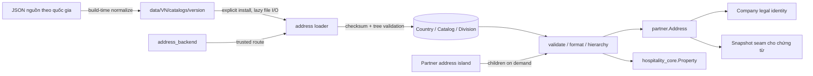

# Address và dữ liệu địa giới Việt Nam

KetSuite port hành vi địa chỉ cần thiết từ the domain contract nhưng không sao chép schema
`res.country.state`. Module `address` là một bounded context dùng chung cho mọi
quốc gia; dữ liệu từng nước nằm trong thư mục mang mã ISO 3166-1 alpha-2 và chỉ
được đọc khi quản trị viên yêu cầu cài catalog.

Source chính:

- `packages/ketsuite/src/modules/address` — country, catalog, division, loader,
  validate, format và snapshot;
- `packages/ketsuite/src/modules/address_backend` — màn hình cài và duyệt catalog;
- `packages/ketsuite/src/modules/partner` — địa chỉ nghiệp vụ tham chiếu Country và Division;
- `packages/ketsuite/src/modules/partner_backend` — form quốc gia → tỉnh/thành → xã/phường/đặc khu;
- `packages/ketsuite/src/modules/hospitality_core` — vị trí cơ sở lưu trú dùng cùng Country/Division;
- `tools/address-data.ts` — bộ chuyển đổi dữ liệu nguồn sang bundle bất biến;
- `test/address*.test.ts` — unit, HTTP headless và PostgreSQL concurrency.

## Ranh giới thiết kế



KetJS không sở hữu dữ liệu địa chỉ. Framework chỉ cung cấp model, function,
transaction, unique index, `insertIfAbsent`, CAS, HTTP route và island. Module
`address` thuộc KetSuite vì country policy và cách một Partner dùng địa chỉ là
nghiệp vụ của bộ ứng dụng.

Một địa chỉ giao dịch nằm trong `partner.Address`; Country và Division chỉ là dữ
liệu tham chiếu dùng chung. Company tiếp tục lấy tên, mã số thuế và địa chỉ pháp lý
từ Partner đại diện, không tạo bản sao địa chỉ trên `company.Company`.

## Mô hình dữ liệu

```mermaid
erDiagram
  ADDRESS_COUNTRY ||--o{ ADDRESS_CATALOG : has_versions
  ADDRESS_COUNTRY ||--|| ADDRESS_CURRENT_CATALOG : selects
  ADDRESS_CATALOG ||--o{ ADDRESS_DIVISION : contains
  ADDRESS_DIVISION ||--o{ ADDRESS_DIVISION : parent_of
  ADDRESS_CATALOG ||--o{ ADDRESS_DIVISION_TRANSITION : from
  ADDRESS_CATALOG ||--o{ ADDRESS_DIVISION_TRANSITION : to
  ADDRESS_COUNTRY ||--o{ PARTNER_ADDRESS : country
  ADDRESS_DIVISION ||--o{ PARTNER_ADDRESS : terminal_division
  PARTNER_PARTNER ||--o{ PARTNER_ADDRESS : owns

  ADDRESS_CATALOG {
    id id PK
    id countryId FK
    text version UK
    text codeSystem
    text checksum UK
    text status
    int recordCount
  }

  ADDRESS_DIVISION {
    id id PK
    id catalogId FK
    id parentId FK
    text code UK
    text kind
    int level
    text officialName
  }

  PARTNER_ADDRESS {
    id id PK
    id partnerId FK
    text use
    text street1
    text street2
    text locality
    text postalCode
    id countryId FK
    id divisionId FK
  }
```

`CurrentCatalog` là pointer duy nhất của một quốc gia. Địa chỉ mới chỉ nhận Division
thuộc catalog đang hoạt động. Hàm snapshot cung cấp version/catalog, đường dẫn địa
giới, các dòng đã format và `sourceAddressId` để module chứng từ có thể đóng băng
địa chỉ khi xác nhận thay vì giữ một reference còn thay đổi.

`DivisionTransition` chuẩn bị cho các lần sáp nhập/tách địa giới tiếp theo. Catalog
VN đầu tiên chưa sinh transition vì source chỉ cung cấp trạng thái hiện hành.

## Bundle và lazy loading

```text
packages/ketsuite/src/modules/address/data/
├── index.json
├── countries.json
└── VN/
    └── catalogs/
        └── 2025-07-01/
            ├── manifest.json
            ├── policy.json
            └── divisions/
                ├── 0001.json
                ├── 0002.json
                ├── 0003.json
                └── 0004.json
```

Server không đọc `index.json`, manifest hay 3.355 Division lúc khởi động. Lần đầu
gọi `availableCatalogs` mới đọc index nhỏ; chỉ trusted route cài đặt mới đọc
manifest, policy và từng chunk. Mỗi file có SHA-256 trong file cha. Loader từ chối
đường dẫn thoát thư mục, field lạ, code trùng, thiếu parent, nhảy cấp, cycle, sai số
lượng hoặc checksum.

Việc cài đặt diễn ra trong một transaction: claim Country/Catalog bằng
`insertIfAbsent`, insert toàn bộ Division, xác minh xong mới chuyển pointer và đổi
catalog thành `active`. Hai pod cài cùng catalog đồng thời hội tụ về đúng một
Country, một Catalog, một CurrentCatalog và 3.355 Division. Function installer là
`internal`; generic `/_ket/fn/*` không gọi được.

## Dữ liệu Việt Nam đầu tiên

Nguồn nhập là bộ dữ liệu LGPL-3 Vidoo Vietnam Address Core. Bản đã chuẩn hoá và
manifest checksum nằm ngay trong module:

```text
packages/ketsuite/src/modules/address/data/VN/catalogs/2025-07-01/
```

Bundle có hiệu lực `2025-07-01` gồm:

| Cấp/loại | Số lượng |
| --- | ---: |
| Tỉnh | 28 |
| Thành phố trực thuộc trung ương | 6 |
| Xã | 2.621 |
| Phường | 687 |
| Đặc khu | 13 |
| **Tổng** | **3.355** |

34 đơn vị cấp tỉnh và 3.321 đơn vị cấp xã phản ánh mô hình hai cấp của source. Mã
`01..34` và mã tám chữ số của đơn vị cấp xã là mã catalog do Vidoo cung cấp, không
được trình bày như mã thống kê chính thức của Quyết định 19/2025/QĐ-TTg. Field
`codeSystem` vì vậy là `VIDOO_VN_ADDRESS_2025`; `legalBasis` và `sourceUrl` ghi rõ
[Quyết định 19/2025/QĐ-TTg](https://vanban.chinhphu.vn/?docid=214409&pageid=27160).

Checksum source được ghi trong manifest:

- `provinces.json`: `b6af62499d891bf2bc9b7c7f11ed14f69a16422b4e1b796331d94b2a4968197d`;
- `wards.json`: `0b9d49d38486e59b08cefd4fe5930e6e4f22171b7652f2d25f5cb6e88a1236d2`.

Tạo lại bundle từ source:

```sh
tsx tools/address-data.ts \
  --source /path/to/vidoo_vn_address_core/data \
  --output packages/ketsuite/src/modules/address/data/VN/catalogs/2025-07-01 \
  --chunk-size 1000
```

Generator kiểm tra parent, duplicate và số lượng trước khi ghi; output được sắp xếp
ổn định để cùng input tạo cùng JSON và checksum.

## Validation, format và UI

Policy VN yêu cầu đúng một node cấp tỉnh/thành và một node cuối cấp xã/phường/đặc
khu trong cùng đường dẫn. Mã bưu chính không bắt buộc; nếu có phải gồm 5 hoặc 6 chữ
số. Định dạng chuẩn hiện tại:

```text
12 Nguyễn Huệ
Phường Ba Đình, Hà Nội
Việt Nam
```

Partner backend render sẵn form và dữ liệu đang chọn để SSR ổn định. Island chỉ
hydrate vùng cascade: đổi quốc gia tải root, đổi tỉnh/thành tải đúng children qua
`address.listDivisionChildren`. Khi chưa cài catalog, form nói rõ nơi cài và khóa
nút lưu; không giả lập tỉnh/phường, không tải toàn bộ catalog vào trình duyệt.

Company backend dẫn quản trị viên từ pháp nhân sang Partner đại diện để sửa địa chỉ
pháp lý tại một nguồn dữ liệu duy nhất. Input Partner cũ (`street`, `city`, `zip`,
`state`, `country`) còn được nhận ở function boundary cho dữ liệu/test chưa cài
catalog, nhưng storage và output mới dùng field canonical.

Property của Hospitality cũng dùng `street1`, `locality`, `postalCode`, `countryId`
và `divisionId`; list trả `addressLine` đã format. Input text cũ còn được chiếu sang
field canonical trong giai đoạn chuyển tiếp, nhưng không còn cột `city/state/country`
song song trong database.

Evidence từ trình duyệt thật được lưu tại [docs/screenshots/address](screenshots/address/README.md).

## Kiểm thử và vận hành

Chạy đúng phần đang phát triển:

```sh
npm run test:one -- \
  test/address.test.ts \
  test/address-postgres.test.ts \
  test/address-e2e.test.ts \
  test/identity.test.ts \
  test/partner-e2e.test.ts
```

PostgreSQL test tạo database riêng, chạy hai adapter tranh cài VN và tranh địa chỉ
mặc định, rồi xóa database. HTTP test khởi động ứng dụng thật, xác nhận installer
không lộ qua generic function endpoint, POST trusted route, duyệt root và submit
Partner address qua form URL-encoded.

Benchmark trước commit:

```sh
KET_BENCH_PG=postgres://.../ket_address_bench npm run bench:address
KET_BENCH_PG=postgres://.../ket_address_bench npm run bench:identity
```

Kết quả và phương pháp đo nằm tại [docs/benchmarks/address.md](benchmarks/address.md).
Full suite chỉ chạy trên CI khi PR được mở vào `develop`.
