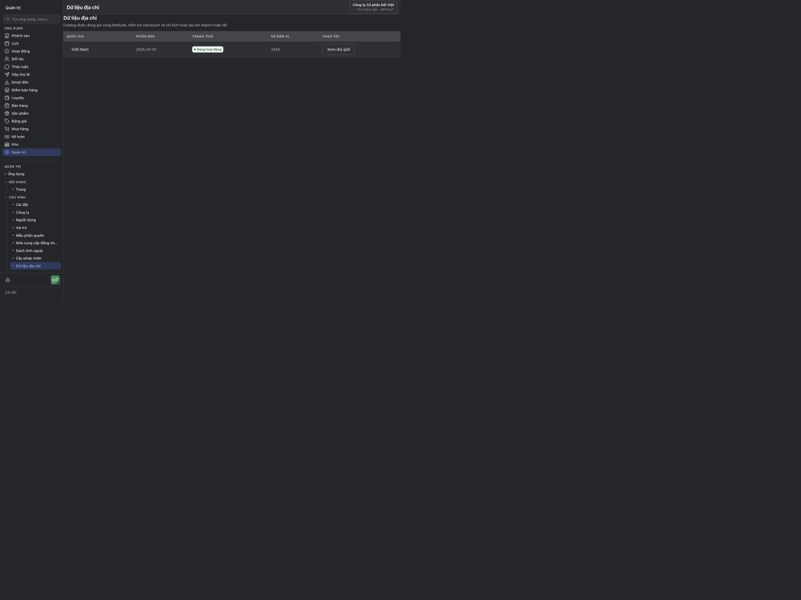
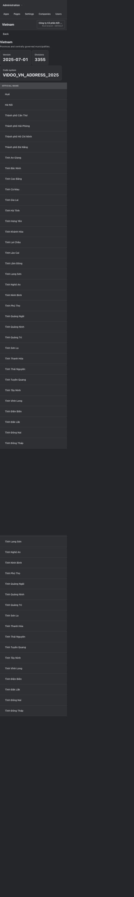
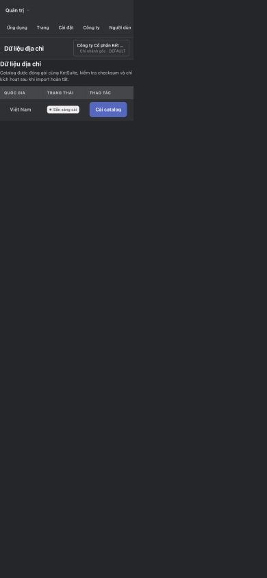
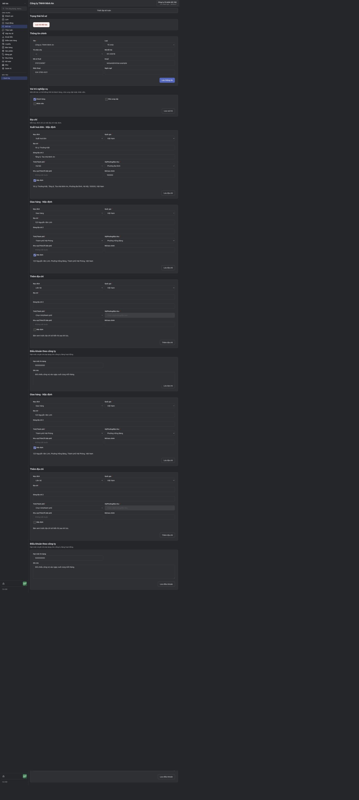
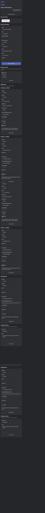
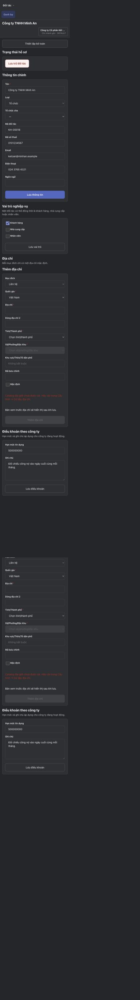
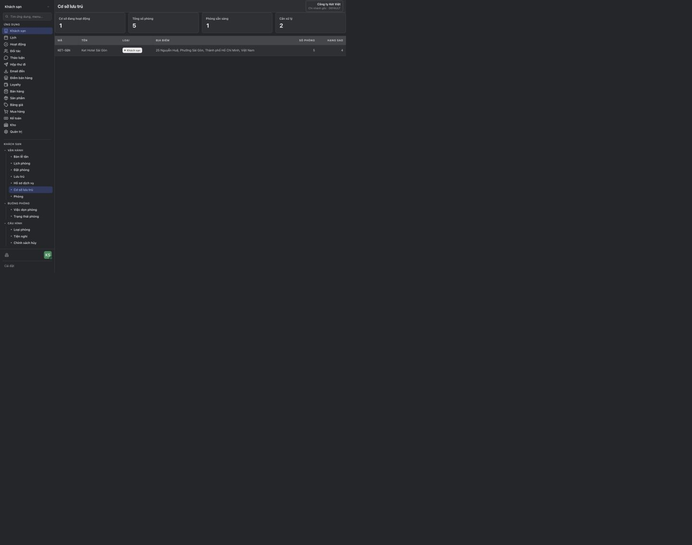

# Address UI evidence

Ảnh được chụp từ ứng dụng KetSuite thật bằng in-app browser sau khi seed database
riêng. Không dùng mock API hoặc ảnh dựng. Ma trận kiểm tra gồm desktop/mobile,
tiếng Việt/Anh, catalog đã cài/chưa cài và các module tiêu thụ địa chỉ.

| Luồng | Kích thước | Locale | Kết quả |
| --- | --- | --- | --- |
| Danh sách catalog đã cài | 1440×900 | vi | Không tràn trang/bảng; VN active, 3.355 đơn vị |
| Cây địa giới cấp tỉnh | 390×844 | en | 34 dòng; chỉ giữ cột chính trên mobile |
| Danh sách catalog chưa cài | 390×844 | vi | Hiện trạng thái và action cài; không tràn |
| Partner có catalog | 1440×900 và 390×844 | vi/en | Cascade tải 34 tỉnh, chọn TP.HCM tải 168 đơn vị + placeholder; có Phường Sài Gòn |
| Partner chưa có catalog | 390×844 | vi | Thông báo rõ và khóa toàn bộ action lưu địa chỉ |
| Company | 390×844 | en | Link địa chỉ pháp lý trỏ tới Partner đại diện |
| Hospitality Property | 1440×900 và 390×844 | vi/en | Hiển thị địa chỉ đã format, không tràn trang/bảng |

## Catalog Việt Nam

## Module sử dụng địa chỉ

