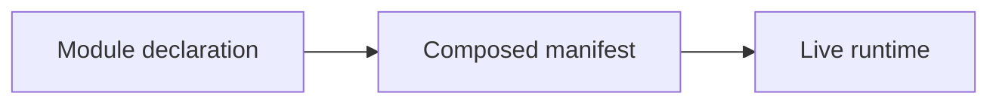

## Requirements

- Node.js 24 or later.
- The npm version bundled with Node.js.

## Run locally

From the repository root:

```bash
# Run from: /path/to/ketjs
cd docs
npm install
npm run dev
```

Alternatively, keep your current working directory:

```bash
# Run from: /path/to/ketjs
npm --prefix docs install
npm --prefix docs run dev
```

Astro prints the local URL and reloads when the content or theme changes.

## Validate a change

```bash
# Run from: /path/to/ketjs
npm --prefix docs run check
npm --prefix docs run build
```

`docs/package-lock.json` is this application's only lockfile. Do not add Astro, Starlight, or docs
plugins to the root `package.json` or `package-lock.json`.

## Write in English

All published content, frontmatter, navigation labels, image descriptions, and diagrams must be in
English. Translate legacy documents before moving them into the Starlight content collection.

## Place content by reader task

Do not organize a page around the pull request that introduced it. Organize it around the task a
future developer needs to complete, and link it from the hub that owns that journey.

| Content | Location | Reader entry point |
| --- | --- | --- |
| Framework contracts and usage | `src/content/docs/ketjs/` | [KetJS framework](/ketjs/) |
| KetSuite ownership and application behavior | `src/content/docs/ketsuite/` | [KetSuite developer guide](/ketsuite/) |
| Deployment, migration, workers, storage, and measurements | Owning KetJS guide plus `operations/` evidence | [Operations reading map](/operations/) |
| Accepted cross-cutting choices and unresolved design work | `src/content/docs/architecture/` | [Design records](/architecture/) |
| Team-specific integration notes | `src/content/docs/handoffs/` | Contributing sidebar only; exclude from search when appropriate. |

One concept should have one owning guide. Add links from related pages instead of copying the same
contract into several sections. Every published page must be reachable from the explicit sidebar or
from a hub page; drafts stay out of public navigation until they are translated and reviewed.

## Add a page

Create a Markdown or MDX file under `src/content/docs/`. Every page needs at least a `title` and a
`description` in its frontmatter:

```md
<!-- File: docs/src/content/docs/example.md -->
---
title: Page title
description: One sentence explaining the problem this page solves.
---
```

Navigation is declared explicitly in `astro.config.mjs`. Extend the taxonomy as legacy documents
are translated and migrated.

Do not add documentation pages beside `docs/package.json` or update legacy `docs/*.md` files in
place. Move useful material into a correctly categorized page under `src/content/docs/`, add
frontmatter, and link it from the Starlight sidebar when it should be discoverable.

## Add a Mermaid diagram

Use a fenced `mermaid` block. Diagrams are rendered only on pages that contain one and automatically
follow the current light or dark theme.

````md
<!-- File: docs/src/content/docs/example.md -->

````

Keep diagrams focused on one relationship, use English labels, and prefer simple flows that remain
readable in the dense content column. Do not encode essential information only by color; explain the
contract in the surrounding text as well.
