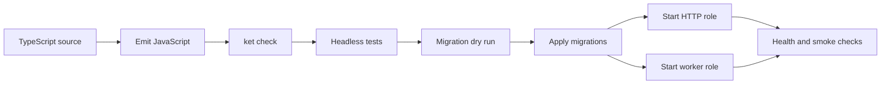

A KetJS release is an emitted JavaScript workspace plus the packages, migrations, configuration, and
external services selected by that workspace. The HTTP server and durable worker are separate process roles
over the same composed manifest and datastore.

## Release pipeline



Do not execute TypeScript loaders in production. Compile the workspace and every imported module, theme,
route, job, and tenant provider to paths that remain valid in the deployment artifact.

## Build and validate

An application normally provides project-specific scripts around this sequence:

```bash
npm ci
npm run build
ket check --workspace dist/ket.workspace.js
ket test dist/test
ket migrate --app erp --workspace dist/ket.workspace.js
```

Use `ket snapshot` and `ket diff` when a release process reviews manifest changes. Treat a clean manifest
diff as necessary but not sufficient: schema compatibility is determined against the actual datastore.

## Apply migrations before traffic

For one datastore, `ket migrate` is a source-controlled planning aid: it compares the manifest with
`.ket/schema.<app>.json`, prints SQL, and advances that snapshot. Apply the reviewed plan with an
application-owned deployment script that opens the real adapter and calls `migrateOne()`, or let one
controlled boot migrate before normal replicas start.

For a tenant fleet, the CLI opens each database and owns the apply step:

```bash
ket migrate --app erp --workspace dist/ket.workspace.js --all --dry-run
ket migrate --app erp --workspace dist/ket.workspace.js --all
```

Set `KET_MIGRATE=0` on normal application pods after the release system owns migration order. This prevents
many replicas from racing to alter the same schema during rollout. Destructive plans require an explicit
`--allow-destructive` decision and should include a restore plan.

## Run separate roles

```bash
ket serve --app erp --workspace dist/ket.workspace.js
ket worker --app erp --workspace dist/ket.workspace.js
```

Scale HTTP replicas for request load. Scale worker replicas for queue throughput; each replica still follows
the per-queue concurrency declared by `worker.queues`. Database leases make claims durable across crashes.

Keep HTTP and worker deployments on the same release artifact during a schema or job-contract transition.
If a rolling deployment allows old and new code to overlap, make database and payload changes backward
compatible for that interval.

## Required production decisions

Before starting traffic, decide and configure:

- a datastore adapter and connection policy;
- a stable `KET_SECRET` shared by every HTTP replica;
- a separate `KET_WEBHOOK_SECRET` when anonymous callbacks are enabled;
- local or S3-compatible object storage;
- worker queues, concurrency, timeouts, retries, and shutdown grace;
- tenant catalogue and bounded adapter pool for tenant deployments;
- module bootstrap and auto-install policy;
- logs, metrics, readiness, backups, and disaster recovery.

Do not place durable local SQLite or object-storage files in an ephemeral container layer. Mount persistent
storage or choose external services.

## PostgreSQL

Install the optional driver in the application and make adapter ownership explicit:

```ts
import { defineApp } from '@ketvietlab/ketjs'
import { postgresAdapter } from '@ketvietlab/ketjs-postgres'

export const erp = defineApp({
  name: 'erp',
  modules: [core],
  headless: true,
  serve: {
    openStore: async (config) => {
      if (!config.databaseUrl) throw new Error('DATABASE_URL is required')
      const adapter = postgresAdapter(config.databaseUrl, { max: 20 })
      await adapter.open()
      return adapter
    },
  },
})
```

Install both `@ketvietlab/ketjs-postgres` and its optional `postgres` peer dependency. The application owns the driver
dependency, opens the adapter in `openStore`, and returns it ready for use; KetJS core owns only the
`Adapter` contract. Graceful shutdown closes the returned adapter.

## S3-compatible storage

Configure `KET_STORAGE=s3` plus endpoint, region, bucket, and credentials. KetJS signs requests directly;
provider networking and credential distribution remain deployment responsibilities. Prefer workload
identity or a secret manager over credentials in an image or repository.

Object storage is namespaced per app or tenant at runtime. Preserve the namespace contract when moving
data between environments.

## Health and graceful shutdown

Expose a small application route for readiness, for example:

```ts
serve: {
  routes: () => ({
    '/health': () => json({ ok: true }),
  }),
}
```

Readiness should prove that the process has completed composition and boot. Add a datastore check only if
the orchestrator's request rate will not overload a dependency during an incident.

On shutdown:

1. stop accepting new HTTP work or job claims;
2. allow in-flight requests and jobs to finish within their grace periods;
3. stop heartbeats and polling;
4. close sessions, storage/provider resources, adapters, and sockets;
5. let expired job leases become retryable if a worker cannot finish.

Configure the platform termination grace period longer than the app's worker `shutdownGraceMs`.

## Rollback strategy

Code rollback is safe only while the previous release understands the current schema and durable payloads.
Prefer additive changes in one release, migrate producers and consumers in another, then remove obsolete
fields later. For a destructive migration, restore data or deploy a forward fix; reverting code alone does
not recreate dropped data.

## Production checklist

- The artifact contains emitted ESM and no production TypeScript loader.
- `ket check` and targeted headless tests pass against the artifact.
- Migration output was reviewed against representative data.
- HTTP and worker roles use the same app, manifest, secrets, and datastore.
- Sessions survive pod changes and restarts.
- Tenant pools are bounded and unknown tenants fail closed.
- Queue concurrency matches provider and database limits.
- Persistent storage, backups, log retention, and secret rotation are defined.
- Readiness and shutdown behavior were exercised during a rolling deployment.
