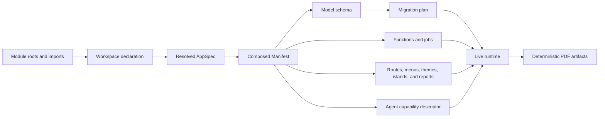

KetJS is a zero-required-dependency full-stack framework for Node.js. It composes models, server
functions, routes, jobs, themes, and agent capabilities into one checked manifest. KetSuite is built
on this framework, but every KetJS primitive can also be used to build an independent application.

:::caution[Development status]
KetJS is currently in the `0.1.x` preview line and has not reached a stable release. APIs, data formats, CLI
behavior, and deployment assumptions may change without notice. Do not treat the current version as
production-ready.
:::

## Install

Create a new SQLite-backed application directly from npm:

```bash
npx -y @ketvietlab/ketjs@latest new my_app --dir ./my-app
cd my-app
npm install
npm run dev
```

For an existing project, install the framework with `npm install @ketvietlab/ketjs`. Add
`@ketvietlab/ketjs-postgres` and its `postgres` peer only when the application uses PostgreSQL.

## Design goals

KetJS is organized around six constraints:

1. **Explicit composition.** A module extends only contracts published by a dependency. There is no
   import-time registration or arbitrary monkey-patching.
2. **One artifact.** The composed manifest is the module graph, schema source, function inventory,
   theme contract, and agent descriptor.
3. **Declared effects.** A function or job can access only the models, queues, storage, and transports
   named in its effects.
4. **Safe presentation.** First-party UI uses `@ketvietlab/ketjs-view`; third-party themes use restricted KTL and
   cannot execute JavaScript.
5. **Operational durability.** Migrations, idempotency, queues, streams, storage, and multitenancy are
   framework contracts rather than application conventions.
6. **Business-owned documents.** A module declares its printable data contract and default template;
   the framework provides safe compilation and deterministic PDF rendering without creating a parallel
   report module for every domain.

## Packages

| Package | Use it for |
| --- | --- |
| `@ketvietlab/ketjs` | Modules, workspaces, data, functions, HTTP, jobs, storage, sessions, and composition. |
| `@ketvietlab/ketjs/pdf` | Constrained report markup, HTML preview, Inter font assets, and deterministic PDF rendering. |
| `@ketvietlab/ketjs/theme` | KTL compilation, theme runtime helpers, view models, and design tokens. |
| `@ketvietlab/ketjs/testing` | Isolated headless end-to-end applications and an HTTP test client. |
| `@ketvietlab/ketjs-view` | Browser-safe signals, HTML templates, SSR, hydration, JSX, and islands. |
| `@ketvietlab/ketjs-postgres` | The optional PostgreSQL adapter. SQLite remains the built-in default. |

`@ketvietlab/ketjs` depends only on `@ketvietlab/ketjs-view`. The core package has no required database driver or service SDK.

## How an application is assembled



The deployment decides which modules it ships. Each database decides which shipped application
modules are enabled. Installing or removing a module changes behavior, not schema; migrations are
planned from the complete deployment manifest.

## Choose a path

- Start with [Quick start](/ketjs/quick-start/) to scaffold and run a minimal application.
- Read [Workspaces and apps](/ketjs/workspaces/) when one repository serves multiple processes or
  applications.
- Read [Modules and manifest](/ketjs/modules/) before creating reusable business capabilities.
- Continue with [Models and scopes](/ketjs/models/), [Queries and changesets](/ketjs/data/), and
  [Functions and effects](/ketjs/functions/) for the core server model.
- Use [Form validation](/ketjs/form-validation/), [Rendering and islands](/ketjs/rendering/), and
  [Themes and KTL](/ketjs/themes/) for UI work.
- Use [Reports and PDF](/ketjs/reports/) for printable business documents.
- Finish with [Testing](/ketjs/testing/) and [Deployment](/ketjs/deployment/) before shipping an app.

## Current runtime requirements

- Node.js 24 or later.
- ESM (`"type": "module"`).
- TypeScript for authored applications; production executes emitted JavaScript only.
- SQLite by default, or PostgreSQL through `@ketvietlab/ketjs-postgres` and the optional `postgres` driver.

KetJS does not execute TypeScript in production. The development scaffold uses `tsx` only as an
in-memory compiler and watcher.
