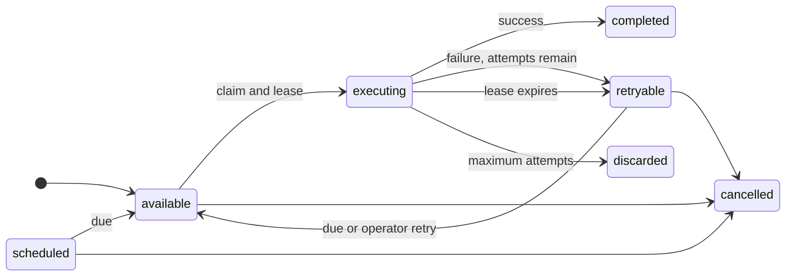

KetJS jobs are durable rows in the application database. Enqueueing may share a transaction with
business data, and a separate worker process claims jobs with leases. Redis is not required.

## Declare a job

```ts
import { defineJob, defineModule } from 'ketjs'

export const sales = defineModule({
  name: 'sales',
  jobs: {
    sendConfirmation: defineJob({
      queue: 'mail',
      input: { orderId: 'id' },
      effects: ['read:sales.Order', 'transport:send'],
      idempotent: true,
      maxAttempts: 8,
      timeoutMs: 30_000,
      handler: async (ctx, { orderId }) => {
        const order = await loadOrder(ctx, String(orderId))
        await ctx.transport.send({
          idempotencyKey: `sales.confirmation:${order.id}`,
          from: { address: 'orders@example.com', name: 'Orders' },
          to: [{ address: order.email }],
          subject: `Order ${order.number}`,
          text: `Your order ${order.number} is confirmed.`,
        })
      },
    }),
  },
})
```

`idempotent: true` is mandatory because delivery is at least once. The queue defaults to `default`;
declare operationally meaningful queues when workloads need different concurrency.

The job context extends the normal function context with:

- `job`: execution ID, key, queue, current attempt, and maximum attempts;
- `signal`: aborted on timeout or shutdown;
- `storage`: tenant-namespaced storage wrapped by declared effects;
- `transport`: configured outbound transport wrapped by declared effects.

## Enqueue atomically

The producer declares the enqueue effect:

```ts
functions: {
  confirmOrder: {
    input: { orderId: 'id' },
    effects: [
      'write:sales.Order',
      'enqueue:sales.sendConfirmation',
    ],
    handler: (ctx, { orderId }) =>
      ctx.tx(async (tx) => {
        await tx.db.update(
          'sales.Order',
          { id: orderId },
          { status: 'confirmed' },
        )
        return tx.jobs.enqueue(
          'sales.sendConfirmation',
          { orderId },
          { uniqueKey: `confirmation:${orderId}` },
        )
      }),
  },
}
```

If the transaction rolls back, neither the business update nor the durable job remains. PostgreSQL
publishes its wake-up notification on the same transaction connection and only after commit.

## Scheduling, priority, and uniqueness

`jobs.enqueue()` accepts:

```ts
await ctx.jobs.enqueue('billing.issueInvoice', { orderId }, {
  runAt: new Date(Date.now() + 5 * 60_000),
  priority: 10,
  uniqueKey: `invoice:${orderId}`,
})
```

- Lower priority numbers run first.
- `runAt` schedules future availability.
- `uniqueKey` coalesces active jobs with the same job name and key.

Queue uniqueness prevents duplicate active delivery; it does not replace business idempotency. A key
is released after a terminal state, and an at-least-once worker may still retry a handler whose result
was committed externally before acknowledgement.

## Configure the worker

Every shipped queue must be configured on the app:

```ts
const app = defineApp({
  name: 'erp',
  modules: [sales],
  headless: true,
  serve: { bootstrap: ['sales'] },
  worker: {
    queues: {
      mail: 4,
      maintenance: 1,
    },
    pollMinMs: 50,
    pollMaxMs: 2_000,
    tenantRefreshMs: 30_000,
    leaseMs: 30_000,
    shutdownGraceMs: 15_000,
  },
})
```

Run separate production roles:

```bash
ket serve --app erp --workspace dist/ket.workspace.js
ket worker --app erp --workspace dist/ket.workspace.js
```

In development:

```bash
ket dev --all --app erp --workspace dist/ket.workspace.js
```

## Delivery model

Job states are `available`, `scheduled`, `executing`, `retryable`, `completed`, `discarded`, and
`cancelled`.



Workers:

1. claim due jobs in priority and schedule order;
2. assign a worker ID and lease deadline;
3. heartbeat long-running work;
4. complete successful work;
5. retry failures with preserved error history;
6. discard after `maxAttempts`;
7. rescue expired leases after a worker crash.

PostgreSQL `LISTEN/NOTIFY` shortens wake-up latency. Polling and database leases remain the guarantee,
so lost notifications do not lose jobs.

## Timeouts and cancellation

Observe `ctx.signal` in provider calls and long loops:

```ts
await ctx.transport.send(message, { signal: ctx.signal })

for (const item of items) {
  ctx.signal.throwIfAborted()
  await processItem(item)
}
```

`timeoutMs` aborts the signal; it cannot forcibly roll back an arbitrary external side effect. Use
idempotency keys and provider APIs that accept abort signals.

## Operator commands

```bash
ket jobs list --state retryable --queue mail --limit 50
ket jobs retry JOB_ID
ket jobs cancel JOB_ID
ket jobs prune
```

Tenant applications require `--tenant NAME`. `retry` makes retryable or discarded work available now
while preserving attempt history. `cancel` applies to nonterminal work. `prune` uses the built-in
retention policy for terminal rows.

## Testing jobs

`createTestApp()` opens a worker handle for apps with worker configuration but does not leave a polling
loop running. Drain explicitly where the scenario expects asynchronous work to settle:

```ts
await e2e.client.call('sales.confirmOrder', { orderId: 'o1' })
const completed = await e2e.drainJobs()
assert.equal(completed, 1)
```

Use `worker: false` when the test intentionally verifies queued state without executing jobs.

## Job design rules

- Make handlers safe when invoked more than once.
- Derive external provider idempotency keys from stable business identity.
- Keep input small; store large payloads in models or storage and enqueue references.
- Declare every data, enqueue, storage, and transport effect.
- Check the abort signal during long work.
- Separate queues only when their concurrency or operational priority differs.
- Monitor retryable, discarded, executing, and lease-age counts.
- Keep HTTP and worker deployments on the same application artifact and manifest version.
