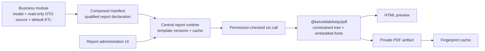

KetJS treats a printable document as a manifest capability. The business module owns the data projection,
default template, translations, and target model. A central report application may then manage versions,
preview documents, and cache artifacts without importing the business module.

## Architecture and ownership



The ownership boundary is deliberate:

- A business module owns the semantic document: target model, explicit output DTO, default KTL, filename,
  paper settings, and translations.
- The central report runtime owns operator customizations, immutable published versions, rollback, preview,
  artifact storage, and cache invalidation.
- `@ketvietlab/ketjs/pdf` owns the portable rendering engine and has no knowledge of Sale, Purchase, Stock, Account, or
  any other application domain.
- A backend module discovers available documents through `reportsOf()` and adds Print actions to its existing
  record screen.

Do not create `sale_report`, `stock_report`, or similar companion modules merely to print records. Keep each
declaration beside the domain source it describes. Create a separate module only when the report itself is an
independently installable cross-domain capability with its own ownership and dependency graph.

```ts
import { defineModule } from '@ketvietlab/ketjs'

export default defineModule({
  name: 'sale',
  models: { Order: { scope: 'company', fields: { id: 'id', name: 'text' } } },
  functions: {
    getQuotationReport: {
      input: { id: 'id' },
      effects: ['read:sale.Order'],
      handler: async (ctx, { id }) => (await ctx.db.select('sale.Order', { id }))[0] ?? null,
    },
  },
  reports: {
    quotation: {
      title: 'sale.report.quotation',
      target: 'sale.Order',
      source: 'sale.getQuotationReport',
      filename: 'quotation',
      paper: 'A4',
      orientation: 'portrait',
      template: `<report><text size="20">{{ name }}</text></report>`,
    },
  },
})
```

Composition qualifies the local name as `sale.quotation`. It rejects unknown target models, missing sources,
and sources with write or enqueue effects. `restrictManifest()` removes reports belonging to disabled modules.
Themes cannot declare reports.

The source function should publish an explicit `output` schema. Treat that projection as the stable report DTO:
templates must not receive arbitrary database rows, session objects, or framework services. The source may read
the target and its dependencies, but composition refuses write, delete, transport, storage-write, or enqueue
effects.

## Report KTL

`compileReportTemplate()` uses KTL expressions, conditions, loops, filters, translation, and controlled partials.
Report mode rejects raw output and the web-only `joint`, `region`, `island`, and `sections` primitives. Rendered
output is parsed into a typed document tree rather than accepted as arbitrary HTML.

Supported markup includes `report`, `header`, `footer`, `section`, `stack`, `row`, `text`, `table`, `thead`,
`tbody`, `tr`, `th`, `td`, `image`, and `page-break`. Image `src` values are attachment identifiers whose PNG
or JPEG bytes must be supplied through `renderPdf({ images })`; they are never fetched as URLs. Page attributes accept A4/A5, portrait/landscape, and point-based
margins. Network resources, scripts, CSS, declarations, and unknown tags or attributes are refused.

```ts
import { readFile } from 'node:fs/promises'
import {
  compileReportTemplate,
  interFontUrl,
  renderPdf,
  renderReportHtml,
} from '@ketvietlab/ketjs/pdf'

const document = compileReportTemplate(source, { translate }).render(viewModel)
const preview = renderReportHtml(document)
const [font, semiboldFont, boldFont] = await Promise.all([
  readFile(interFontUrl()),
  readFile(interFontUrl('semibold')),
  readFile(interFontUrl('bold')),
])
const pdf = renderPdf(document, { font, semiboldFont, boldFont })
```

The framework ships the same Inter family used by KetSuite: Regular, SemiBold, and Bold, under the SIL Open Font
License. Pass all three files to preserve the application typography in titles, metadata, table headings, and
totals; callers that pass only `font` retain Regular as a backwards-compatible fallback. The renderer embeds the
supplied TrueType files and writes Unicode maps, so Vietnamese output does not depend on fonts installed on the
host. `tone="accent"` and `tone="muted"` use fixed KetSuite document roles, while table headings receive the
accent-soft surface automatically. Current text shaping covers Latin scripts; complex-script shaping, RTL, and
emoji are outside the contract.

## Request integration

`ServeContext.reportsOf(url, request, target)` returns only installed declarations for the target whose source
function the current viewer may call. A screen can build generic Print actions from this result. The printing
route must still invoke the source through `ctx.call()` so permission and company scope are enforced at render
time.

Resource limits cap KTL source size, loop iterations, rendered markup nodes, and PDF pages. Applications should
load images only from their controlled attachment store and use fingerprinted private caches for generated bytes.

## Template lifecycle and cache

A central report application can layer managed templates over manifest defaults without changing the framework
ownership model:

1. The manifest template is always the installable fallback.
2. Saving a draft uses optimistic revision checks so two editors cannot silently overwrite each other.
3. Publishing records an immutable version containing both template and layout settings.
4. Rollback copies a selected published version into a new draft; it never mutates history.
5. Publish invalidates cached artifacts for that report and may enqueue a maintenance purge.

Cache keys should fingerprint the canonical report DTO, effective template, layout, locale, renderer version, and
font version. Store generated bytes privately and use a bounded, non-sliding lifetime. Cache reads must never skip
the source call: invoking the source first rechecks viewer permission, tenant/company scope, and current data before
an artifact can be reused.

## Synchronous print route

For ordinary business documents, a synchronous route keeps authorization and failure behavior simple:

```ts
routes: {
  '/reports/{report}/{id}': (ctx) => async (url, req, params) => {
    const available = await ctx.reportsOf(url, req, 'sale.Order')
    const report = available.find((item) => item.id === params.report)
    if (!report) return text('Not found', { status: 404 })

    const dto = await ctx.call(report.source, { id: params.id }, url, req)
    const document = compileReportTemplate(report.template, {
      translate: ctx.translate(ctx.localeOf(url, req)),
    }).render(dto)
    const [font, semiboldFont, boldFont] = await Promise.all([
      readFile(interFontUrl()),
      readFile(interFontUrl('semibold')),
      readFile(interFontUrl('bold')),
    ])
    const pdf = renderPdf(document, { font, semiboldFont, boldFont })

    return withHeaders(bytes(pdf, { type: 'application/pdf' }), {
      'cache-control': 'private, no-store',
      'content-disposition': `inline; filename="${report.filename}.pdf"`,
    })
  },
}
```

Applications may add a private server-side artifact cache around this flow. Cache/storage write failures should be
observable but should not turn an otherwise valid synchronous PDF response into an error.

## Architecture checklist

- Declare the report on the module that owns the target business record.
- Project a minimal, explicit DTO from a read-only source function.
- Discover print actions with `reportsOf()` and call the source again at render time.
- Compile only with report-safe KTL and parse into constrained report markup.
- Resolve images from tenant-scoped attachment storage; never fetch template URLs.
- Fingerprint data, template, layout, locale, engine, and fonts before cache reuse.
- Keep published versions immutable and invalidate report artifacts on publish.
- Test permission filtering, manifest restriction, pagination, repeated headers, images, and Vietnamese glyphs.
