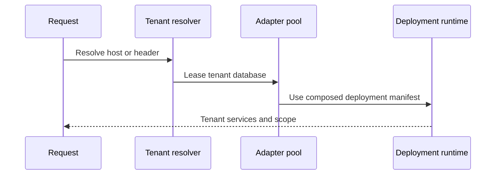

Sessions answer who a request represents; scope answers which company and branch its operations may
read and write; tenants answer which database contains that identity and data. KetJS keeps these
contracts separate because deployments resolve them in different orders.

## Development identity shim

Without `serve.sessions`, the runtime reads company context from headers:

```text
# File: docs/src/content/docs/ketjs/sessions-tenants.md
X-Ket-Company
X-Ket-Companies
X-Ket-Current-Branch
X-Ket-Branch
```

This allows early development and tests but is not authentication. Production applications should
configure sessions and resolve current account state.

## Enable sessions

```ts
// File: src/app.ts
const app = defineDeployment({
  name: 'backoffice',
  modules: [users, sales],
  headless: true,
  serve: {
    sessions: {
      idleTtlMs: 7 * 24 * 60 * 60_000,
      absoluteTtlMs: 30 * 24 * 60 * 60_000,
      anonymous: null,
    },
    resolveSession: async ({ adapter, record }) => {
      return loadCurrentMemberships(adapter, record.userId)
    },
  },
})
```

Set a stable signing key in every environment:

```bash
# Run from: /path/to/example-app
KET_SECRET='a-long-random-deployment-secret' ket serve
```

If the secret is absent, KetJS generates an ephemeral value and reports it in the banner. That is
acceptable for an isolated test, not a multi-pod deployment or restart-stable login.

## Start and end sessions

A login route verifies credentials through an internal function, then uses the request's session
manager:

```ts
// File: src/app.ts
const sessions = await ctx.sessionsOf(url, request)
if (!sessions) return json({ ok: false }, { status: 500 })

const { cookie } = await sessions.start({
  userId: user.id,
  companies: user.companyIds,
  company: user.defaultCompanyId,
  branches: user.branchIds,
  branch: user.defaultBranchId,
  securityVersion: user.securityVersion,
})

return withHeaders(json({ ok: true }), {
  'set-cookie': cookie,
})
```

Logout calls `sessions.end(request)` and returns `sessions.clearCookie()`. Administrative changes can
invalidate all sessions for a user with `endUser()` or every session except the current one with
`endUserExcept()`.

The cookie is signed, `HttpOnly`, `SameSite=Lax`, path-wide, and secure outside local plain HTTP.
Sessions have an idle deadline refreshed during use plus an absolute, non-refreshable deadline.

## Revalidate live identity

Session rows are snapshots. Use `resolveSession` to verify that the account is still active and update
company/branch memberships before scope and permissions are calculated:

```ts
// File: src/app.ts
resolveSession: async ({ adapter, record }) => {
  const current = await loadIdentity(adapter, record.userId)
  if (!current || current.disabled) return null

  return {
    companies: current.companyIds,
    company: current.companyIds.includes(record.company)
      ? record.company
      : current.companyIds[0],
    branches: current.branchIds,
    branch: current.branchIds.includes(record.branch ?? '')
      ? record.branch
      : current.branchIds[0] ?? null,
    securityVersion: current.securityVersion,
  }
}
```

Return `null` to reject the session. KetJS updates context atomically by session revision so concurrent
company switching cannot silently overwrite newer state.

## Resolve function permissions

```ts
// File: src/app.ts
serve: {
  permissions: async (ctx, userId, url, req) => {
    return loadGrantedFunctionKeys(ctx, userId, url, req)
  },
}
```

Returning an array restricts every function call for that request, including calls made by routes.
Returning `null` means no restriction. Prefer an explicit role resolver in production rather than
omitting the callback accidentally.

The request comes with it because answering the question almost always means asking the database, and
which database that is comes from the request. Pass `url` and `req` straight through to
`ctx.callUnchecked` — a resolver that invents them can only ever reach the tenant a bare URL happens
to resolve to, which is the wrong one for every tenant but the default.

Permissions grant operations, not tables. Use `ket permissions --role NAME` to inspect the resulting
read, write, enqueue, cross-company, and output reach.

## Session stores

`createSessions()` supports:

- `memorySessionStore()` for isolated processes and tests;
- `dbSessionStore(adapter)` for restart-stable sessions in one database;
- a custom `SessionStore` for a shared identity datastore.

With subdomain tenancy, the host identifies the tenant before the cookie is read, so sessions can live
inside each tenant database. If one domain serves every tenant, resolve the tenant first from an
authenticated gateway assertion or another explicit request key and provide a shared identity store.
Do not make the session select its own datastore: resolving the database would require reading a
session from a database that has not yet been selected.

KetJS stamps every record written through a tenant session manager with that tenant key. Reads,
context updates, logout, and user-wide revocation are filtered by the same key, so a valid cookie from
one tenant is treated as anonymous by another even when both managers use the same backing store.
Existing shared-store rows created before tenant binding have no tenant key and fail closed; plan for
those users to sign in again during the upgrade rather than assigning an ambiguous legacy session.

## One database per tenant

Configure `serve.tenants` when each customer has an independent datastore:

```ts
// File: src/app.ts
const app = defineDeployment({
  name: 'erp',
  modules: [core, sales],
  headless: true,
  serve: {
    tenants: {
      resolve: (_url, request) => {
        const host = request.headers.host?.split(':')[0] ?? ''
        return host.endsWith('.erp.example') ? host.slice(0, -'.erp.example'.length) : null
      },
      list: () => tenantCatalogue.listKeys(),
      open: (key, config) => openTenantDatabase(key, config),
      exists: (key, config) => tenantDatabaseExists(key, config),
      max: 20,
      idleMs: 60_000,
    },
  },
})
```

`resolve()` returning `null` produces `E_UNKNOWN_TENANT`; KetJS never falls back to a default customer.
The bounded adapter pool leases one tenant for the duration of a callback and prevents connections
from escaping their lease. An adapter counts as busy while `open()` is pending, so a concurrent request
cannot evict or close a connection that the first request is still establishing.

Schema preparation is cached against both the tenant key and the concrete adapter. If eviction later
reopens that key on a new connection—or as a fresh SQLite `:memory:` database—the replacement is migrated
and initialized before it reaches the request. A failed preparation is removed from the cache so the next
lease can retry instead of replaying a permanently rejected promise.

`tenants.open()` is an adapter factory: return a fresh adapter object for each pool entry and let the
pool own `open()`/`close()` rather than caching an object that the pool already closed.
`tenants.exists()` must inspect the tenant catalogue or storage location without creating or opening the
datastore. KetJS requires it for `ket schema verify --tenant/--all`, so a read-only audit cannot turn a
missing SQLite tenant into an empty database.

Per-tenant session handles are lease-safe facades rather than captured database connections. If an
idle adapter is evicted, the next session operation leases the replacement and rebuilds its database
store before reading the cookie. Tenant deployments without an explicit signing secret generate one
stable key for the lifetime of the booted process; the startup banner still warns that those sessions
cannot survive a restart or span multiple pods.

For one tenant key, every replacement session manager must keep the backing store identity, tenant
binding, signing-secret provenance, cookie policy, and anonymous scope unchanged. KetJS compares that
adapter-independent policy on reacquisition and raises `E_SESSION_POLICY_DRIFT` instead of letting an
eviction silently change authentication or authorization behavior.

## Per-tenant runtime state

Every tenant uses the immutable module composition declared by its DeploymentSpec. On every request
KetJS resolves data ownership, never a tenant-specific module lifecycle:



The runtime caches compiled themes, joints, and sessions per tenant. Changing module composition means
shipping a new deployment; every tenant in that deployment receives the same manifest and schema.

Never hold a tenant adapter, `live` manifest, session manager, or storage object in a process-global
variable.

## Anonymous scope

Public storefronts may configure `sessions.anonymous` with a deliberately limited scope. A missing
session otherwise has no scope. Anonymous functions and routes still require explicit declarations;
anonymous scope is not unrestricted access.

## Operational checklist

- Configure one stable `KET_SECRET` across pods.
- Keep password verification in an internal function behind a dedicated login route.
- Revalidate disabled users, memberships, and security versions.
- Rotate or invalidate sessions after security-sensitive changes.
- Keep tenant resolution deterministic and reject unknown hosts.
- Bound tenant database connections with `max` and `idleMs`.
- Run fleet migrations before serving new code.
- Test at least two tenants and two companies to detect accidental cache or scope reuse.

See [Testing](/ketjs/testing/) for cookie-aware clients and tenant-isolated fixtures.
