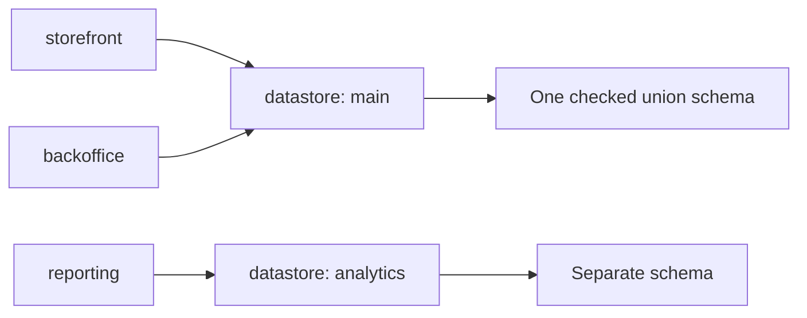

A workspace is the deployment boundary. It lists every application built from the repository and the
optional module roots those applications may resolve. An app selects modules, a theme, a datastore,
an HTTP role, and a worker role.

## Declare a workspace

Prefer a default export from `ket.workspace.ts`:

```ts
import { defineApp, defineWorkspace } from '@ketvietlab/ketjs'
import { catalog, checkout, storefrontTheme } from './modules/index.ts'

const storefront = defineApp({
  name: 'storefront',
  modules: [catalog],
  theme: storefrontTheme,
  datastore: 'main',
  serve: {
    bootstrap: ['catalog', 'storefront_theme'],
  },
})

const backoffice = defineApp({
  name: 'backoffice',
  modules: [catalog, checkout],
  datastore: 'main',
  headless: true,
  serve: {
    bootstrap: ['catalog', 'checkout'],
  },
  worker: {
    queues: { default: 4, maintenance: 1 },
  },
})

export default defineWorkspace({
  apps: [storefront, backoffice],
})
```

Application and module names use lowercase letters, digits, and underscores and must begin with a
letter.

## `defineApp()` fields

| Field | Meaning |
| --- | --- |
| `name` | Stable application identity used by the CLI and runtime artifacts. |
| `modules` | Imported modules or string references resolved from `modulePaths`. |
| `theme` | One theme module for a rendered application. |
| `datastore` | Logical datastore name. Apps with the same value share one union schema. Defaults to `main`. |
| `requires` | Region contracts required by the application. |
| `headless` | Disables theme/page rendering. A headless app cannot declare a theme or `serve.pages`. |
| `serve` | HTTP, sessions, tenants, storage, transport, and datastore configuration. |
| `worker` | Durable queues consumed by the separate worker process role. |

`defineApp()` validates contradictory declarations immediately. Composition performs the graph and
contract checks that require all modules.

## Shared datastores

`composeWorkspace()` composes every application separately, then unions schemas for apps bound to the
same datastore:



Two apps sharing a datastore must agree about every common model and column. KetJS reports
`E_DATASTORE_MODEL_CLASH` or `E_DATASTORE_COLUMN_CLASH` during composition rather than allowing the
disagreement to reach migration or runtime.

Use different datastore names when applications intentionally own separate persistence boundaries.

## Headless applications

Set `headless: true` for APIs, workers, administration backends, or integration services that render
no themed pages:

```ts
const api = defineApp({
  name: 'catalog_api',
  modules: [catalog],
  headless: true,
  serve: {
    routes: (ctx) => ({
      '/health': () => json({ ok: true, app: ctx.config.host }),
    }),
  },
})
```

Import `json` from `@ketvietlab/ketjs` in the complete file. Headless affects presentation only; the app may still
declare models, functions, jobs, storage, sessions, and routes.

## HTTP and worker roles

The HTTP server and worker are different process roles of the same app artifact:

```ts
const app = defineApp({
  name: 'orders',
  modules: [orders],
  headless: true,
  serve: { bootstrap: ['orders'] },
  worker: {
    queues: { fulfillment: 8 },
    pollMinMs: 50,
    pollMaxMs: 2_000,
    leaseMs: 30_000,
    shutdownGraceMs: 15_000,
  },
})
```

Every job queue contributed by the app's modules must appear in `worker.queues`. Missing queue
configuration is a composition error. Run the roles separately in production:

```bash
ket serve --app orders --workspace dist/ket.workspace.js
ket worker --app orders --workspace dist/ket.workspace.js
```

Development can run both under one watcher with `ket dev --all`.

## Several apps in one workspace

The CLI selects an app with `--app`. If no app is named, commands use the first suitable app:

```bash
ket check --workspace dist/ket.workspace.js
ket manifest --app storefront --workspace dist/ket.workspace.js
ket serve --app backoffice --workspace dist/ket.workspace.js
```

Use `ket workspace` to inspect app manifests, datastore sharing, shared modules, and modules used by
only one app.

## Programmatic composition

Build tools can use the same boundary as the CLI:

```ts
import { composeWorkspace, explainWorkspace, resolveWorkspace } from '@ketvietlab/ketjs'

const resolved = await resolveWorkspace(declaration, {
  baseUrl: new URL('./ket.workspace.js', import.meta.url),
  allowSource: false,
})

const composed = composeWorkspace(resolved.apps)
console.log(explainWorkspace(composed))
```

Pass resolved `AppSpec` objects to runtime APIs. String module references are valid only at the
workspace declaration boundary.

## Workspace rules

- A workspace file executed in production must be emitted JavaScript.
- A headless app cannot select a theme or page resolver.
- A worker must declare at least one queue and positive integer concurrency.
- One theme may be selected by an app, but the current runtime does not yet automatically uninstall a
  previously enabled theme.
- Sharing a datastore is explicit and checked; it is never inferred from a connection string.

Continue with [Modules and manifest](/ketjs/modules/) to define the units selected by an app.
