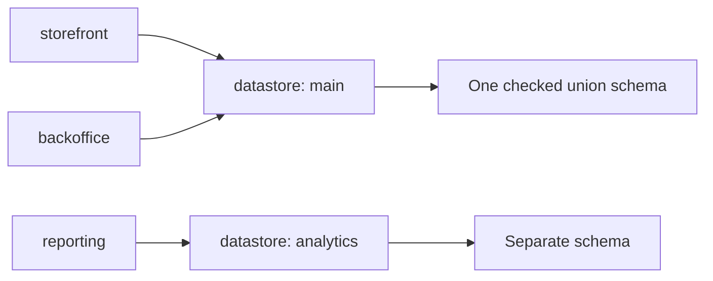

A workspace lists every deployment built from a repository and the optional module roots those
deployments may resolve. A deployment selects its complete module composition, theme, datastore,
HTTP role, and worker role.

## Declare a workspace

```ts
// File: ket.workspace.ts
import { defineDeployment, defineWorkspace } from '@ketvietlab/ketjs'
import { catalog, checkout, storefrontTheme } from './modules/index.ts'

const storefront = defineDeployment({
  name: 'storefront',
  modules: [catalog],
  theme: storefrontTheme,
  datastore: 'main',
})

const backoffice = defineDeployment({
  name: 'backoffice',
  modules: [catalog, checkout],
  datastore: 'main',
  headless: true,
  worker: { queues: { default: 4, maintenance: 1 } },
})

export default defineWorkspace({
  deployments: [storefront, backoffice],
})
```

Deployment and module names use lowercase letters, digits, and underscores and begin with a letter.

## `defineDeployment()` fields

| Field | Meaning |
| --- | --- |
| `name` | Stable deployment identity used by the CLI and runtime artifacts. |
| `modules` | Complete module list, including string references resolved from `modulePaths`. |
| `theme`, `themes` | Default and selectable theme modules. |
| `datastore` | Logical datastore name. Deployments with the same value share a checked union schema. |
| `requires` | Region contracts required by the deployment. |
| `headless` | Disables theme/page rendering. |
| `serve` | HTTP, sessions, tenants, storage, transport, and datastore configuration. |
| `worker` | Durable queues consumed by a separate worker process role. |

There is no second bootstrap list. If a module appears in `modules`, it is composed, migrated, and
available at runtime. Removing it requires changing the deployment source and releasing a new artifact.

## Shared datastores

`composeWorkspace()` composes every deployment separately, then unions schemas for deployments bound
to the same datastore:



Deployments sharing a datastore must agree about every common model and column, including nullability and
reference targets. Indexes contributed by only one deployment join the union schema; indexes with the same
name must agree about fields, uniqueness, and provenance. KetJS reports `E_DATASTORE_MODEL_CLASH`,
`E_DATASTORE_COLUMN_CLASH`, or `E_DATASTORE_INDEX_CLASH` during composition.

## HTTP and worker roles

```ts
// File: src/deployment.ts
const ordersDeployment = defineDeployment({
  name: 'orders',
  modules: [orders],
  headless: true,
  serve: {},
  worker: {
    queues: { fulfillment: 8 },
    pollMinMs: 50,
    pollMaxMs: 2_000,
    leaseMs: 30_000,
    shutdownGraceMs: 15_000,
  },
})
```

Every queue contributed by the deployment's modules must appear in `worker.queues`. Run the roles
from the same emitted artifact:

```bash
# Run from: /path/to/example-deployment
ket serve --deployment orders --workspace dist/ket.workspace.js
ket worker --deployment orders --workspace dist/ket.workspace.js
```

## Programmatic composition

```ts
// File: tools/inspect-workspace.ts
import { composeWorkspace, explainWorkspace, resolveWorkspace } from '@ketvietlab/ketjs'

const resolved = await resolveWorkspace(declaration, {
  baseUrl: new URL('../dist/ket.workspace.js', import.meta.url),
  allowSource: false,
})

const composed = composeWorkspace(resolved.deployments)
console.log(explainWorkspace(composed))
```

String module references are valid only at the workspace declaration boundary. Runtime APIs receive
resolved `DeploymentSpec` objects with executable modules.

## Workspace rules

- Production executes emitted JavaScript, never TypeScript source loaders.
- A headless deployment cannot select a theme or page resolver.
- A worker declares at least one queue and positive integer concurrency.
- Datastore sharing is explicit and checked.
- Every tenant of one deployment receives the same manifest and schema.

Continue with [Modules and manifest](/ketjs/modules/) to define the selected units.
