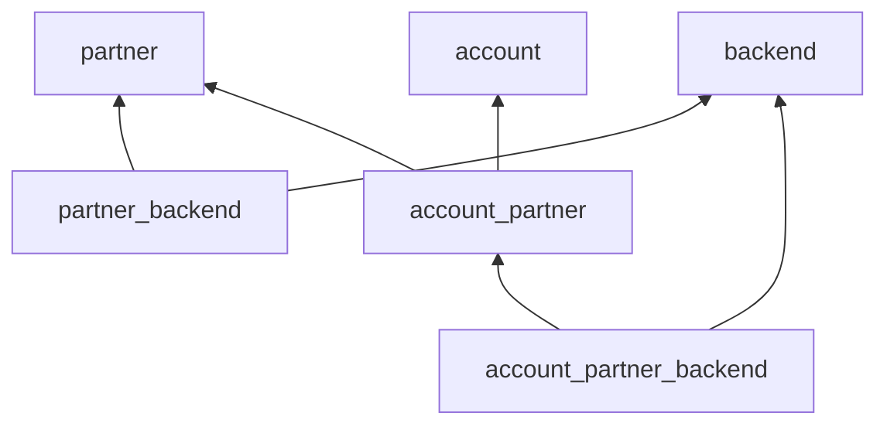

KetSuite is assembled explicitly in `packages/ketsuite/src/app.ts`. There is no import-time module
registry: `createKetsuiteApp()` passes the complete module list to `defineApp()`, and KetJS composes it
into the manifest used by migration, permissions, HTTP dispatch, workers, and rendering.

## Three module layers

KetSuite module names encode an ownership pattern, not a mandatory framework feature.

| Layer | Typical name | Owns | Must not own |
| --- | --- | --- | --- |
| Domain | `partner`, `sale`, `loyalty` | Models, invariants, functions, jobs, reports, domain messages | Admin-only markup or another domain's integration policy |
| Backend | `partner_backend`, `sale_backend` | `/admin/...` routes, screens, menus, islands, backend translations | Duplicate business rules or direct writes around domain functions |
| Bridge | `account_partner`, `loyalty_sale` | Behavior that is meaningful only when two modules are installed | A patch hidden inside either domain owner |

Shared capability modules such as `backend`, `mail`, `activity`, `calendar`, `storage`, `user`, and
`channel_api` provide contracts used by several verticals. Website modules and themes form a separate
presentation vertical but obey the same dependency rules.

The bridge keeps `partner` usable without accounting and prevents `account` from importing partner
implementation details. The backend bridge follows the same rule for its screen contribution.

## Module families in the packaged app

The application composition groups capabilities by dependency direction. This map is an orientation
aid; the `modules` array in `app.ts` remains the executable inventory.

| Family | Domain and capability modules | Companion pattern |
| --- | --- | --- |
| Web and channels | `website`, `channel_api`, `website_menu`, `website_seo`, `website_search`, `website_form` | Website backend plus hospitality and retail website bridges |
| Identity and organization | `address`, `partner`, `company`, `user`, `oauth`, `hr`, `attendance` | One backend companion per management surface; accounting is linked through `account_partner` |
| Collaboration | `mail`, `mail_transport`, `mail_inbound`, `activity`, `calendar` | Backend modules plus model-specific mail, inbound, activity, and calendar bridges |
| Product and stock | `uom`, `product`, `product_media`, `pricing`, `stock` | Product, pricing, and stock backends; mail and activity bridges attach collaboration |
| Commercial flow | `purchase`, `sale`, `pos` | Separate backends; Sale connects to CRM, loyalty, mail, activity, stock, pricing, and accounting through dependencies or bridges |
| Finance and reporting | `account`, `report` | Accounting and report backends plus partner, mail, and activity bridges |
| Growth | `crm`, `loyalty` | CRM and loyalty backends with Sale, POS, and Website bridges |
| Industry verticals | `hospitality_core` | Website and theme integrations compose hospitality behavior without moving it into generic commerce modules |

Several backend modules intentionally depend on the shared `backend` module, while domain modules do
not. This makes headless composition possible and prevents admin presentation from becoming a hidden
requirement of business logic.

## Shipped, bootstrapped, and enabled

These states are intentionally different:

1. The app's `modules` array declares everything shipped by the process and therefore everything that
   participates in composition and schema planning.
2. The `serve.bootstrap` list declares modules installed into a new database.
3. Runtime module state determines which shipped behavior is enabled for a particular database.

Do not remove a module from the app merely to hide it in one database. Conversely, adding it to the
composition does not mean every existing database should automatically receive its behavior. Use
module dependencies and install policy for lifecycle decisions; see [Modules and manifest](/ketjs/modules/).

Backend companions commonly use `install: 'auto'`: after their dependencies are enabled, KetJS may
install them automatically. Infrastructure such as the backend and Channel API is non-removable where
losing it would also remove the recovery or contract boundary.

## Application-owned runtime policy

The app declaration owns policy that no individual module can decide safely:

- datastore selection and SQLite defaults;
- default and fallback locale;
- default timezone;
- worker queue concurrency;
- anonymous-session defaults;
- staff-session resolution and permission lookup;
- customer versus anonymous audience resolution;
- website page resolvers and the site title.

Keep domain functions independent of these deployment defaults. They should consume `ctx.scope`, the
active locale, declared transports, and framework services rather than reading process-wide state.

## Composition order is a contract

KetJS validates dependencies and produces a topological order; source-array position is still kept
readable so humans can audit the application. Add a module close to its domain and companions. A module
may contribute to another module's joint, reserved route prefix, or model only through a declared
dependency and the owner's published contract.

When a new feature crosses domains, prefer this decision sequence:

1. Put an invariant used by only one domain in that domain module.
2. Put presentation for that domain in its backend or website companion.
3. Put behavior requiring two independently useful domains in a bridge module.
4. Promote a helper to the package public API only when an external module needs the same boundary.

This keeps installation graphs meaningful and makes accidental circular dependencies visible at
composition time.
