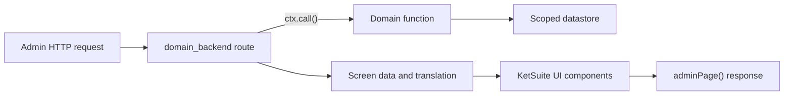

KetSuite's backend is trusted first-party UI. It is server-rendered with `@ketvietlab/ketjs-view` and
the shared component kit in `@ketvietlab/ketsuite/ui`; it is not a replaceable storefront theme.
Client JavaScript is added only as an island for interaction that cannot be represented by a normal
request, response, or URL.

## Request-to-screen flow



Backend companions normally contain `index.ts`, `routes.ts`, `screens.tsx` or a `screens/` directory,
`menus.ts`, and optional `islands.ts` plus client assets. Use a `screens/` directory when list, detail,
edit, and secondary record views have independent responsibilities; export their public entry points
from `screens/index.ts`. Their manifest depends on the domain and `backend`; it may declare assets,
styles, routes, menus, messages, islands, joints, and fills.

## Route responsibilities

A route parses the request, calls domain functions, selects locale-aware navigation, and chooses a
screen. Keep business validation in the domain function.

```ts
// File: packages/ketsuite/src/modules/example_backend/routes.ts
import { randomUUID } from 'node:crypto'
import { text } from '@ketvietlab/ketjs'
import type { Route, ServeContext } from '@ketvietlab/ketjs'
import { adminPage, inLocale, readForm, seeOther } from '@ketvietlab/ketsuite/backend'

export const routes = {
  '/admin/example/new':
    (ctx: ServeContext): Route =>
    async (url, request) => {
      if (request.method === 'GET')
        return adminPage(ctx, url, request, {
          title: 'example_backend.create.title',
          body: (_, frame) => exampleForm(_, frame),
        })

      if (request.method !== 'POST') return text('GET or POST', { status: 405 })
      const form = await readForm(request)
      const id = randomUUID()
      const result = await ctx.call('example.saveExample', { id, ...form }, url, request)
      return (result as { ok?: boolean }).ok
        ? seeOther(inLocale(url, `/admin/example/${id}`))
        : adminPage(ctx, url, request, {
            title: 'example_backend.create.title',
            body: (_, frame) => exampleForm(_, frame, result),
          })
    },
}
```

Use `ctx.call()` for staff-facing operations so the request's session, permissions, scope, and effects
are enforced. `ctx.callUnchecked()` is for narrow infrastructure boundaries that perform their own
authentication and authorization; it is not a shortcut for backend code.

## Screens use the component kit

The public `@ketvietlab/design-system` package is the source of truth for tokens, shared primitives,
application shell, page and record layouts, and reusable patterns. Import new shared UI directly from
that package. Existing screens may import compatibility components from `@ketvietlab/ketsuite/ui`, or
backend framing and helpers from `@ketvietlab/ketsuite/backend`, while they migrate. The compatibility
entry also exposes the public package as `designSystem`; it must not redefine raw visual values.

Screens should compose components rather than authoring raw tags or new `data-ui` hooks.
`tools/ui-audit.ts` protects that contract so markup and styles do not drift across dozens of screens.
Run `npm run design:system` to inspect every public specimen at `http://127.0.0.1:4100/`.

The kit includes list chrome, tables, cards, record workspaces, forms, actions, tabs, progressive
`Disclosure` for secondary detail, notices, empty and error states, media and attachment panels, date
pickers, calendars, and scheduling primitives.
Prefer PascalCase exports in TSX where available.

Keep list state in the URL: search terms, filters, grouping, page, view, visible columns, archived state,
and locale should survive a copied link. Reuse the backend paging and search helpers instead of creating
a module-local query-string convention.

### Page surface hierarchy

All three canonical patterns share component-owned surface roles. A light operational page uses a
quiet grey context/identity band and controls, a white working region, and a grey contextual rail.
`ListPage`, `RecordPage`, and `WorkspacePage` keep their existing header measurements and structure;
do not implement the hierarchy with a route-local background override or another whole-page card.

| Region | Token / behavior |
| --- | --- |
| Context and identity header | `--kv-page-chrome-bg`: page grey in light, existing panel tone in dark |
| Controls and record tabs | `--kv-page-bg`: continuous quiet navigation band |
| List, record, vertical workspace content | `--kv-page-content-bg`: white in light, existing canvas tone in dark |
| Spatial workspace canvas | `--kv-page-bg`: cards, table surfaces and timelines remain independent objects |
| Tables | `--kv-table-bg`: opaque white in light; transparent in dark, preserving row hover/selection |
| Sidebar and record rail | Existing sidebar / subtle panel tokens, separated with low-contrast borders |

These roles alias the existing palette; they do not add brand colours or change the dark palette.
`FormPage`, `DashboardPage`, and `BoardPage` are compatibility adapters for the same surface rules, not
additional page patterns. Do not add new consumers of those adapters.

Open the catalogue's **Review page surfaces** link, or
`http://127.0.0.1:4100/surfaces?kind=record&theme=light&lang=vi` to inspect a full-page specimen.
The permalink supports `kind=list|record|flow|canvas`, `lang=en|vi`, `theme=light|dark`, and
`state=baseline|loading|empty|error|validation|readonly`. Record tabs preserve page padding; optional
rails and controls can be hidden without leaving empty chrome. Compatibility specimens are available
as `form-compat`, `dashboard-compat`, and `board-compat` for migration regression checks.

Run targeted component and surface browser coverage when changing these roles:

```sh
# Run from: ketjs repository root
npm run build --silent
node --test .build/test/design-system.test.js
npm --prefix e2e run test:design-system -- page-surfaces.spec.ts
```

### List page layout

Use the design system's `ListPage` as the baseline for an operational collection. The screen provides
translated identity, the primary action, URL-driven list chrome, optional result context, and the list
body. `ListPage` keeps those regions in a stable order and owns their responsive spacing; a module must
not recreate that hierarchy with a route-specific header or a card around the whole page.

Keep the primary create action in `actions`, where it stays beside the title. Put
search/filter/view/paging controls in `controls` and the result count in `status`; the pattern combines
those two slots into one command bar instead of scattering them over separate rows. The table, kanban,
or empty state belongs in `body`. More capable KetSuite tables can still provide selection, groups,
sorting, and configurable columns inside the public page pattern. The product catalogue at
`/admin/product/templates` is the reference integration for this composition.

### Record workspace layout

Use `RecordWorkspace` for a deep record or edit screen. The shared layout owns the hierarchy rather
than each module rebuilding it:

- breadcrumbs, identity, record actions, and summary facts span the complete workspace;
- the action controller occupies the upper-right of the identity header and wraps below the identity on
  narrow screens;
- tabs remain between the record summary and the active body;
- an optional aside starts beside the body, not beside the breadcrumbs or identity header, and follows
  the body on narrow screens.

Pass an explicit three-level breadcrumb trail when the module has a catalogue or directory level. Older
screens receive a stable fallback from `kicker` and `title`. For an edit form whose submit action belongs
in the record header, set `RecordForm.submitPlacement` to `external` and place a button associated through
its `form` attribute in `RecordWorkspace.controller`. This keeps native form submission and validation
while avoiding a duplicate submit row inside the form card.

## Forms and validation

Render the values a developer submitted after a validation failure and map domain issues to their
owning fields. The domain function remains authoritative; client validation is an early feedback layer,
not a replacement for server checks. Follow the shared issue shape and the KetJS
[Form validation](/ketjs/form-validation/) contract.

Use Post/Redirect/Get after successful mutation. This prevents refresh from resubmitting a command and
keeps the record URL canonical. A rejected form should render directly with its errors and preserve
the input.

`AppShell` owns the page's single `main` landmark. Patterns rendered inside it, including `FormPage`,
use sections and neutral body containers instead of adding another `main`; optional contextual rails
use a labelled `aside`. This keeps the primary reading region unambiguous for assistive technology.

## Islands

An island declares a validated prop contract, a stable identity key, server view, and client export:

```ts
// File: packages/ketsuite/src/modules/example_backend/islands.ts
export const islands = {
  'example.editor': {
    props: { identity: 'text', recordId: 'id?', lang: 'text?' },
    key: ['identity'],
    client: 'example.mjs',
    export: 'editor',
    view: (props) => createExampleEditorView(props),
  },
}
```

Author non-trivial island views as typed TS or TSX beside the shared UI layer. A scoped build may emit
their browser ESM into the owning module's declared asset root; generated `.mjs` files are deployment
artifacts and must not be edited by hand. Keep `@ketvietlab/ketjs-view` external in that build and import
the copy served at `/_ket/view/`, otherwise every island bundles a second renderer. A module can keep
styles and generated browser entries under one asset root even when the authoring source lives in the
UI layer.

Do not hydrate an entire page to implement a small selector. Server rendering must remain useful before
hydration, and island props must contain only data the current viewer is allowed to receive.

### Charts

A chart is a canvas, so it is an island — `backend.chart`, reached through the
`backend:screen.chart` joint. `chartControl` resolves one the way `relationControl`
resolves a picker:

```ts
// File: packages/ketsuite/src/modules/example_backend/routes.ts
const plot = await chartControl(ctx, url, req, 'example-revenue', {
  kind: 'line',
  label: _('example_backend.revenue.title'),
  labels: buckets.map((bucket) => bucket.label),
  datasets: [{ label: _('example_backend.revenue.now'), series: 1, values, formatted }],
  axis: axisScale(peakOf(datasets), units),
})
```

Two rules the config exists to enforce. The island is handed props and nothing else — no
context, no translator, no company currency — so every amount arrives already formatted
and every word already translated, including the axis unit; a browser bundle that
formatted money would disagree with the tables printed beside it. And a dataset carries a
palette slot rather than a colour: the client reads `--admin-chart-N` off the document
when it mounts, so `tokens.css` stays the only place a chart hue is named and a
colour-scheme change is re-read rather than baked in.

The same rule applies to server-rendered tables. Use `formatMoney(_, value, currency)` for business
amounts and `formatDateTime(_.locale, instant, options)` for instants. Both reuse immutable Intl
formatters; constructing `Intl.NumberFormat` or `Intl.DateTimeFormat` inside a column `cell` callback
makes formatter setup scale with the row count.

Pair the canvas with `Chart`, whose legend carries the same numbers as real text. A
canvas has no text in it, so a reader without the bundle, a screen reader, and a printed
page all get nothing from it — the legend is what makes the chart optional rather than
load-bearing, and it can carry links a canvas cannot. `BarChart` is server-rendered for
that last reason: its rows link into the ledger behind each bar.

`chart.js` is bundled by `tools/build-chart-client.mjs`, separate from the island builder
because it pulls a real dependency into the output — the same reason the Live Doc editor
has its own builder for `yjs`. Both are named exceptions in `tools/zero-dep-audit.ts`,
not an open door, and both are imported through the package's root entry only.

## Module-owned styles

The public design-system package owns the shared shell, tokens, and UI-kit baselines. The build copies
its CSS into the backend asset tree and loads it before KetSuite compatibility styles; never edit that
generated copy. A feature module must ship
its visual rules from its own asset root instead of adding product-, partner-, or route-specific selectors
to the backend design styles:

```ts
// File: packages/ketsuite/src/modules/example_backend/index.ts
export default defineModule({
  name: 'example_backend',
  depends: ['backend'],
  assets: new URL('./client/', import.meta.url),
  styles: ['example.css'],
  routes,
  menus,
})
```

Composition namespaces the asset URL by module and loads dependency styles first, so `backend` provides
the baseline before `example_backend` applies its scoped adjustments. Keep module rules inside
`@layer ket.app`, scope them to a module-owned root or state, and consume semantic tokens. Add a rule to
the shared backend styles only when the corresponding component is genuinely reusable through
`@ketvietlab/ketsuite/ui`.

## Extension joints

Publish a joint when another module has a legitimate structural contribution to a screen. Declare its
typed props in the owner, and let dependent modules provide fills. Do not create an empty joint for a
hypothetical extension or use CSS selectors as an extension API.

Cover shared components with contract tests and a representative rendered screen. Generated visual
artifacts may be used locally for inspection, but they are not source documentation and should not be
committed as PR evidence.
