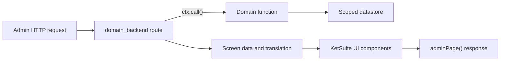

KetSuite's backend is trusted first-party UI. It is server-rendered with `@ketvietlab/ketjs-view` and
the shared component kit in `@ketvietlab/ketsuite/ui`; it is not a replaceable storefront theme.
Client JavaScript is added only as an island for interaction that cannot be represented by a normal
request, response, or URL.

## Request-to-screen flow



Backend companions normally contain `index.ts`, `routes.ts`, `screens.tsx` or a `screens/` directory,
`menus.ts`, and optional `islands.ts` plus client assets. Use a `screens/` directory when list, detail,
edit, and secondary record views have independent responsibilities; export their public entry points
from `screens/index.ts`. Their manifest depends on the domain and `backend`; it may declare assets,
styles, routes, menus, messages, islands, joints, and fills.

## Route responsibilities

A route parses the request, calls domain functions, selects locale-aware navigation, and chooses a
screen. Keep business validation in the domain function.

```ts
// File: packages/ketsuite/src/modules/example_backend/routes.ts
import { randomUUID } from 'node:crypto'
import { text } from '@ketvietlab/ketjs'
import type { Route, ServeContext } from '@ketvietlab/ketjs'
import { adminPage, inLocale, readForm, seeOther } from '@ketvietlab/ketsuite/backend'

export const routes = {
  '/admin/example/new':
    (ctx: ServeContext): Route =>
    async (url, request) => {
      if (request.method === 'GET')
        return adminPage(ctx, url, request, {
          title: 'example_backend.create.title',
          body: (_, frame) => exampleForm(_, frame),
        })

      if (request.method !== 'POST') return text('GET or POST', { status: 405 })
      const form = await readForm(request)
      const id = randomUUID()
      const result = await ctx.call('example.saveExample', { id, ...form }, url, request)
      return (result as { ok?: boolean }).ok
        ? seeOther(inLocale(url, `/admin/example/${id}`))
        : adminPage(ctx, url, request, {
            title: 'example_backend.create.title',
            body: (_, frame) => exampleForm(_, frame, result),
          })
    },
}
```

Use `ctx.call()` for staff-facing operations so the request's session, permissions, scope, and effects
are enforced. `ctx.callUnchecked()` is for narrow infrastructure boundaries that perform their own
authentication and authorization; it is not a shortcut for backend code.

## Screens use the component kit

Import neutral components from `@ketvietlab/ketsuite/ui`, or backend framing and helpers from
`@ketvietlab/ketsuite/backend`. Screens should compose components rather than authoring raw tags or
new `data-ui` hooks. `tools/ui-audit.ts` protects that contract so markup and styles do not drift across
dozens of screens.

The kit includes list chrome, tables, cards, record workspaces, forms, actions, tabs, notices, empty
and error states, media and attachment panels, date pickers, calendars, and scheduling primitives.
Prefer PascalCase exports in TSX where available.

Keep list state in the URL: search terms, filters, grouping, page, view, visible columns, archived state,
and locale should survive a copied link. Reuse the backend paging and search helpers instead of creating
a module-local query-string convention.

### Record workspace layout

Use `RecordWorkspace` for a deep record or edit screen. The shared layout owns the hierarchy rather
than each module rebuilding it:

- breadcrumbs, identity, record actions, and summary facts span the complete workspace;
- the action controller occupies the upper-right of the identity header and wraps below the identity on
  narrow screens;
- tabs remain between the record summary and the active body;
- an optional aside starts beside the body, not beside the breadcrumbs or identity header, and follows
  the body on narrow screens.

Pass an explicit three-level breadcrumb trail when the module has a catalogue or directory level. Older
screens receive a stable fallback from `kicker` and `title`. For an edit form whose submit action belongs
in the record header, set `RecordForm.submitPlacement` to `external` and place a button associated through
its `form` attribute in `RecordWorkspace.controller`. This keeps native form submission and validation
while avoiding a duplicate submit row inside the form card.

## Forms and validation

Render the values a developer submitted after a validation failure and map domain issues to their
owning fields. The domain function remains authoritative; client validation is an early feedback layer,
not a replacement for server checks. Follow the shared issue shape and the KetJS
[Form validation](/ketjs/form-validation/) contract.

Use Post/Redirect/Get after successful mutation. This prevents refresh from resubmitting a command and
keeps the record URL canonical. A rejected form should render directly with its errors and preserve
the input.

## Islands

An island declares a validated prop contract, a stable identity key, server view, and client export:

```ts
// File: packages/ketsuite/src/modules/example_backend/islands.ts
export const islands = {
  'example.editor': {
    props: { identity: 'text', recordId: 'id?', lang: 'text?' },
    key: ['identity'],
    client: 'example.mjs',
    export: 'editor',
    view: (props) => createExampleEditorView(runtime, props),
  },
}
```

Place the client module under the backend module's declared asset root. Do not hydrate an entire page
to implement a small selector. Server rendering must remain useful before hydration, and island props
must contain only data the current viewer is allowed to receive.

## Extension joints

Publish a joint when another module has a legitimate structural contribution to a screen. Declare its
typed props in the owner, and let dependent modules provide fills. Do not create an empty joint for a
hypothetical extension or use CSS selectors as an extension API.

Cover shared components with contract tests and a representative rendered screen. Generated visual
artifacts may be used locally for inspection, but they are not source documentation and should not be
committed as PR evidence.
