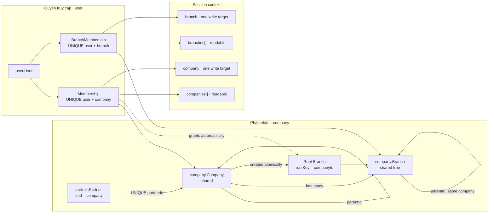
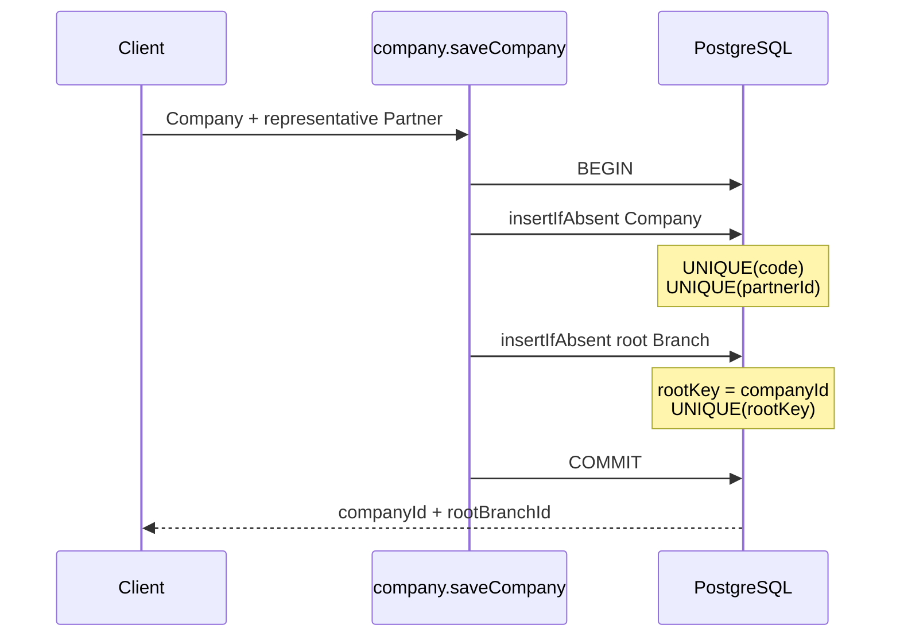
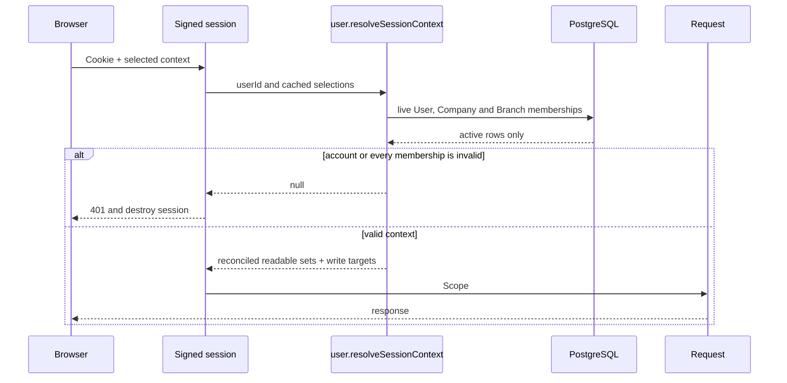

# Company và Branch

Tài liệu này mô tả Company/Branch được port từ the domain contract vào KetSuite, cách phạm vi
đọc/ghi đi từ membership tới session, interface công khai và các bất biến được
cưỡng chế ở PostgreSQL.

Source chính:

- `packages/ketsuite/src/modules/company` — pháp nhân và cây chi nhánh;
- `packages/ketsuite/src/modules/user` — company/branch membership và session context;
- `packages/ketsuite/src/modules/company_backend` — UI quản trị và context switcher;
- `packages/ketsuite/src/modules/backend` — named company/branch selector trên topbar.

## Phạm vi

Cụm này cung cấp:

- Company là pháp nhân, gắn một-một với Partner loại `company`;
- cây Company cho quan hệ công ty mẹ/con có sổ sách riêng;
- cây Branch vận hành nằm trong đúng một Company;
- một root/default Branch được tạo cùng Company trong một transaction;
- Company membership và Branch membership riêng cho từng User;
- một Company và một Branch xác định để ghi, cùng tập Company/Branch được đọc;
- live session resolution ở mỗi request;
- UI list, form, hierarchy, branch management và context switcher vi/en.

Không dùng `Company.parentId` để biểu diễn Branch. Branch cũng không phải pháp nhân
và không có Partner riêng trong subset này.

## Kiến trúc



## Company khác Branch như thế nào

| Khái niệm | Company | Branch |
|---|---|---|
| Ý nghĩa | Pháp nhân có sổ sách và currency | Điểm vận hành trong một pháp nhân |
| Đại diện đối tác | Bắt buộc một Partner loại company | Không có Partner riêng |
| Quan hệ cha | Công ty mẹ/con vẫn là các pháp nhân độc lập | Parent phải thuộc cùng Company |
| Scope dữ liệu | `companyId` | `companyId` và `branchId` |
| Membership | Cho phép đọc/ghi dữ liệu pháp nhân | Cho phép đọc/ghi dữ liệu theo điểm vận hành |
| Mặc định | `User.defaultCompanyId` | `User.defaultBranchId` |

Đây là phần giữ đúng ý nghĩa đa công ty của the domain contract nhưng tránh dùng cây pháp nhân
để mô phỏng kho, cửa hàng hoặc văn phòng.

## Mô hình và bất biến

### Company

`company.Company` là model shared với các field:

- `code` — mã nghiệp vụ unique trong tenant;
- `partnerId` — reference unique tới Partner loại `company`;
- `parentId` — công ty mẹ tùy chọn;
- `currency` — currency của chính pháp nhân;
- `active` — archive/restore không xóa lịch sử.

Service kiểm tra toàn bộ chuỗi `parentId`, không chỉ self-parent, nên cycle nhiều cấp
được từ chối. Một Partner không thể đại diện cho hai Company ngay cả khi hai request
tạo đồng thời.

### Root Branch và cây Branch

Khi tạo Company, service mở transaction:



`rootKey` chỉ có giá trị trên root row. Unique nullable index cho phép nhiều Branch
thường nhưng chỉ một root trong mỗi Company. Generic `saveBranch` luôn gắn Branch
mới dưới root hoặc một parent đã tồn tại, nên không thể tạo root thứ hai qua API.

Với Branch thường:

- code unique trong Company;
- Company không thể đổi sau khi tạo;
- parent phải tồn tại và cùng Company;
- cấm cycle ở mọi độ sâu;
- root được quản lý từ Company và không thể archive trực tiếp.

### Membership

`user.Membership` có unique `(userId, companyId)`. Khi cấp Company:

1. kiểm tra Company đang hoạt động;
2. insert Company membership idempotent;
3. tự cấp root Branch bằng `BranchMembership`;
4. nếu User chưa có default, đặt Company và root Branch làm default;
5. commit toàn bộ trong một transaction.

Branch ngoài root phải được cấp rõ ràng bằng `user.grantBranch`. Service kiểm tra
User đã có Company membership tương ứng trước khi ghi.

Không cho thu hồi default membership của User hoạt động. Quản trị viên phải chọn
default hợp lệ khác trước, tránh để User tồn tại với context không xác định.

### Archive guards

Trong app có User, archive phải đi qua `user.archiveCompany` hoặc
`user.archiveBranch`; core Company từ chối bỏ qua identity guard.

- không archive Company đang là default của User hoạt động;
- không archive pháp nhân hoạt động cuối cùng;
- không archive root Branch;
- không archive Branch đang là default của User hoạt động;
- không archive Branch hoạt động cuối cùng trong Company;
- không restore Branch nếu Company đã archive.

## Session context

Session phân biệt tập đọc và đích ghi như the domain contract:

```text
companies[]  -> các company được đọc
company      -> đúng một company được ghi
branches[]   -> các branch được đọc
branch       -> đúng một branch được ghi
```

`company` bắt buộc nằm trong `companies`; `branch` bắt buộc nằm trong `branches` và
thuộc `company`. Engine tự stamp `companyId`/`branchId` cho model
`company+branch`, không nhận hai field này từ payload.



Cookie chỉ cache lựa chọn gần nhất, không phải nguồn quyền. Resolver chạy ở mỗi
request, vì vậy revoke membership, archive User, Company hoặc Branch có hiệu lực từ
request kế tiếp trên mọi pod. Database session store cập nhật context bằng CAS
`revision`, nên hai thao tác đổi context đồng thời không âm thầm ghi đè nhau.

## Interface công khai

### Company

| Function | Mục đích |
|---|---|
| `company.listCompanies` | Danh sách có tên Partner thật, code, currency, trạng thái và root Branch |
| `company.getCompany` | Company detail cùng toàn bộ Branch |
| `company.saveCompany` | Tạo/cập nhật Company và tạo root nguyên tử |
| `company.listBranches` | Liệt kê Branch theo Company |
| `company.saveBranch` | Tạo/cập nhật Branch và kiểm tra cây |
| `company.contextLabels` | Internal lookup tên Company/Branch cho backend shell |

### User và session bridge

| Function | Mục đích |
|---|---|
| `user.grantCompany` / `revokeCompany` | Company membership và root grant |
| `user.grantBranch` / `revokeBranch` | Explicit Branch membership |
| `user.setDefaultContext` | Đặt default Company/Branch hợp lệ |
| `user.contextOptions` | Internal data cho context screen |
| `user.prepareContext` | Internal actor-bound validation trước session CAS |
| `user.resolveSessionContext` | Internal live reconciliation mỗi request |
| `user.archiveCompany` / `archiveBranch` | Archive qua identity guards |

Mọi lỗi nghiệp vụ trả `{field, code, params?}` và được dịch bằng catalog vi/en.

## Giao diện quản trị

`company_backend` cung cấp:

- danh sách Company và filter archived;
- form tạo/cập nhật Company;
- cây pháp nhân;
- danh sách, form tạo và form chi tiết Branch;
- context screen chọn một Company/Branch để ghi và nhiều Company/Branch để đọc;
- named selector trên topbar luôn hiển thị tên Company và tên/code Branch thật.

Context mutation chỉ chấp nhận POST same-origin. Toàn bộ màn hình giữ locale trong
link và đã được kiểm tra bằng trình duyệt thật ở desktop 1440×900, mobile 390×844,
tiếng Việt và tiếng Anh.

Ảnh kiểm tra:

- `docs/public/screenshots/company/company-list-en-desktop.jpg`;
- `docs/public/screenshots/company/company-detail-vi-desktop.jpg`;
- `docs/public/screenshots/company/context-switcher-vi-mobile.jpg`;
- `docs/public/screenshots/company/branch-detail-vi-mobile.jpg`.

## Kiểm thử theo phạm vi

Các test trực tiếp của cụm:

```sh
npm run build
node --test \
  .build/test/identity.test.js \
  .build/test/session.test.js \
  .build/test/identity-engine.test.js \
  .build/test/company-branch.test.js \
  .build/test/company-branch-e2e.test.js \
  .build/test/backend-ui.test.js \
  .build/test/ketsuite-i18n.test.js
```

PostgreSQL integration trong `test/pg-live.test.ts` chạy nhiều request đồng thời để
xác nhận chỉ có một Company, một root Branch, một Company membership và một
membership cho mỗi Branch. HTTP E2E đi qua login, cookie, permission, routes,
context switch và live membership revocation.

Theo `AGENT.md`, full suite không chạy cục bộ; CI chạy full suite khi PR target
`develop`. Benchmark PostgreSQL phải chạy ngay trước mỗi commit.

## Benchmark PostgreSQL

`bench/identity-company.bench.ts` dựng schema và fixture trước, warm up từng phép
đo, sau đó chỉ tính thời gian của function call bằng monotonic clock. Kết quả báo
`p50`, `p95` và throughput; thời gian build, migration, seed và hash mật khẩu lúc
tạo User không nằm trong mẫu.

Ba workload chung được chạy trên cả `origin/develop` và code của PR:

- list hai Company;
- authenticate User có hai Company membership;
- cấp lại cùng Company membership theo đường idempotent.

Hai workload live session chỉ có ở code mới: resolve context ở mỗi request và
validate context do User yêu cầu. Benchmark yêu cầu URL PostgreSQL tường minh:

```sh
KET_BENCH_PG=postgres://... npm run bench:company-identity
```

Baseline được nạp bằng `KET_BENCH_KETSUITE_MODULE` trỏ tới bản build sạch của
`origin/develop`, nên cùng benchmark, Node.js, engine, PostgreSQL và máy chạy được
dùng cho hai phía. Chênh lệch trên ngưỡng được tối ưu hoặc giải trình trong PR.
