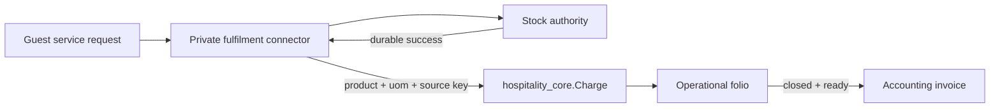

# Hospitality

KetSuite Hospitality keeps reservations, stays, operational folios, and guest charges in the public
`hospitality_core` module. A folio is the operational source of truth for what a guest owes. Accounting
may invoice a closed folio, but it does not own or rewrite the underlying stay activity.

## Charge contract

Every charge records an immutable business description, type, quantity, unit price, amount, and an
idempotent source key. Retrying the same id or source key with identical content returns the original
charge. Reusing either key with different content is rejected, including when two requests race.

Charges may also reference a catalogue `product.Product` and a compatible `uom.Unit`. The product and
its template must be active and saleable. This reference gives reporting, pricing, and integrations a
stable catalogue identity without making Hospitality responsible for stock.

| Charge | Product | Fulfilment | Owner |
|---|---|---|---|
| Room, spa, service, discount | Optional | `none` | Hospitality |
| Minibar or another stock-backed item | Required goods product | `external_stock` | Private deployment connector |

`external_stock` is a boundary marker. The public module refuses to post such a configured extra line
directly. A deployment connector must first obtain a durable stock result and then call `addCharge`
with the goods product, unit of measure, and the same idempotency identity. The public package neither
imports a private stock module nor stores private remote identifiers.

The folio screen intentionally omits minibar from manual charge choices. Allowing an operator to post
it there would bypass the stock acknowledgement and could make the guest folio disagree with stock.

## Billing readiness

The billing queue lists open as well as closed folios so an operator can see and repair every blocker.
Invoice actions remain hidden until the folio is closed, contains charges, all charge types have an
accounting rule, a sales journal exists, and the payer is present. Each blocker links to the nearest
repair screen. The readiness payload contains operational identifiers only and does not expose guest
contact or identity data.

## Data model boundary

- `ExtraLine` describes a requested or recurring service and carries optional product, UoM, charge
  type, and fulfilment kind.
- `Charge` is an immutable posted line. Voids preserve the original row as audit evidence and adjust
  the folio through a correction.
- `Folio` owns the operational total using compare-and-set updates in the same transaction as a new
  charge.
- Product remains tenant-wide catalogue master data. Stock tracking and stock moves remain outside
  the public Hospitality datastore and are coordinated by an explicit deployment connector.

This split also covers separate deployments: Hospitality can run without Stock, while an installation
that enables minibar must provide the connector and its reconciliation evidence.
