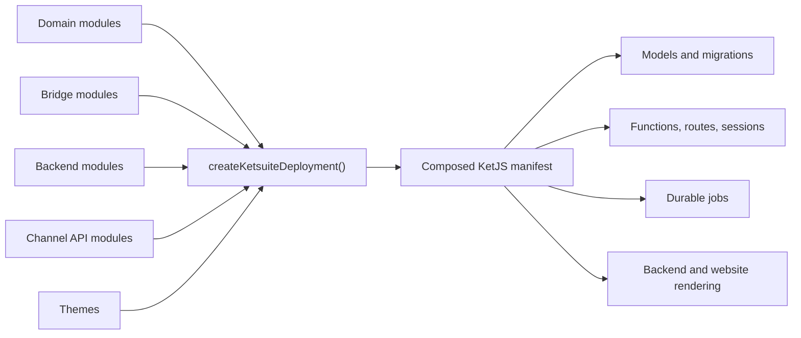

KetSuite is the reference business application built on KetJS. It is both a runnable suite and a set
of composable modules: domain behavior, backend screens, channel APIs, themes, and cross-domain
integrations all use the same public contracts available to a third-party module.

This guide is for developers changing KetSuite or building modules that run beside it. It documents
source boundaries and engineering conventions, not how an operator configures an ERP.

:::caution[Development status]
KetSuite is in the `0.1.x` preview line. Module contracts, package exports, and data models may change
before a stable release. Treat checked-in source and tests as the authority when this guide and a
development branch disagree.
:::

## Repository map

| Path | Responsibility |
| --- | --- |
| `packages/ketsuite/src/deployment.ts` | Packaged module composition, worker queues, sessions, and page integration. |
| `packages/ketsuite/src/modules/<name>/` | Domain model, functions, relations, jobs, reports, and messages owned by one module. |
| `packages/ketsuite/src/modules/<name>_backend/` | Trusted admin routes and screens for a domain module. |
| `packages/ketsuite/src/modules/<a>_<b>/` | Integration logic that depends on both domains without coupling either owner to the other. |
| `packages/ketsuite/src/ui/` | Server-rendered backend component kit and its stable TypeScript surface. |
| `packages/ketsuite/src/themes/` | Restricted storefront themes and their assets. |
| `apps/ketsuite/` | Repository deployment entry used by development and tests. |
| `test/` and `bench/` | Integration, HTTP end-to-end, dialect, contract, and benchmark coverage. |

## Runtime shape

`createKetsuiteDeployment()` accepts an `OpenStore`, so a deployment may retain the exact same module graph
while selecting a datastore. The packaged default uses SQLite at `.ket/ketsuite.db`; repository
deployments can provide the PostgreSQL store. Vietnamese and `Asia/Ho_Chi_Minh` are the packaged
locale and timezone defaults, not assumptions domain code should hard-code.

## Public package boundaries

Use supported package exports instead of reaching into `src/`:

| Import | Use |
| --- | --- |
| `@ketvietlab/ketsuite` | Published modules, constants, types, Channel API helpers, and selected extension contracts. |
| `@ketvietlab/ketsuite/deployment` | `createKetsuiteDeployment()`, `ketsuite`, and `deployments`. |
| `@ketvietlab/ketsuite/ui` | Backend UI components without depending on the backend application module. |
| `@ketvietlab/ketsuite/backend` | Backend module plus screen, route, paging, form, and component helpers. |

An internal file becoming convenient to import is not enough reason to deep-import it. Export the
smallest stable contract from the package entry point and cover that contract with a test.

## Make a KetSuite change in five steps

1. **Run the repository.** Use [Local development](/ketsuite/quick-start/) to build the workspace,
   start the packaged app, and select a focused test.
2. **Find the owner.** Read [Application architecture](/ketsuite/architecture/) for the layer and
   [Module development](/ketsuite/module-development/) for domain, backend, and bridge placement.
3. **Choose the delivery surface.** Use [Backend UI development](/ketsuite/backend-development/)
   for trusted staff screens or [Channel API architecture](/ketsuite/channel-api/) for external
   profiles and generated contracts.
4. **Review boundaries.** Apply [Security and data scope](/ketsuite/security-scope/) before exposing
   a route, function, model projection, company scope, or branch scope.
5. **Prove the behavior.** Follow [Testing KetSuite](/ketsuite/testing/) and the owning business
   guide. Add benchmark evidence only when the change makes or modifies a performance claim.

## Find the guide from the code you touched

| Change | Start here | Then verify |
| --- | --- | --- |
| App composition or bootstrap policy | [Application architecture](/ketsuite/architecture/) | [Security and data scope](/ketsuite/security-scope/) |
| Domain model, function, job, or relation | [Module development](/ketsuite/module-development/) | [Testing KetSuite](/ketsuite/testing/) |
| Admin route, form, screen, menu, or island | [Backend UI development](/ketsuite/backend-development/) | [Form validation](/ketjs/form-validation/) |
| Customer, website, mobile, POS, or integration endpoint | [Channel API architecture](/ketsuite/channel-api/) | [Customer API reference](/ketsuite/channel-api-reference/) |
| CRM behavior | [CRM modules](/ketsuite/crm/) | [Testing KetSuite](/ketsuite/testing/) |
| Manufacturing behavior | [Manufacturing](/ketsuite/manufacturing/) | [Testing KetSuite](/ketsuite/testing/) |
| Loyalty behavior | [Loyalty](/ketsuite/loyalty/) | [Loyalty benchmark evidence](/ketsuite/benchmarks/loyalty/) |
| Vietnam accounting defaults | [Vietnam accounting defaults](/ketsuite/accounting-tt99/) | [Testing KetSuite](/ketsuite/testing/) |

## Framework prerequisites

KetSuite guides explain application policy and ownership. They link into KetJS when the behavior is a
framework contract. The most useful framework references are [Modules and manifest](/ketjs/modules/),
[Models and scopes](/ketjs/models/), [Functions and effects](/ketjs/functions/),
[Sessions and tenants](/ketjs/sessions-tenants/), and [Testing](/ketjs/testing/). Read those pages on
demand; changing KetSuite does not require reading the complete framework manual first.
