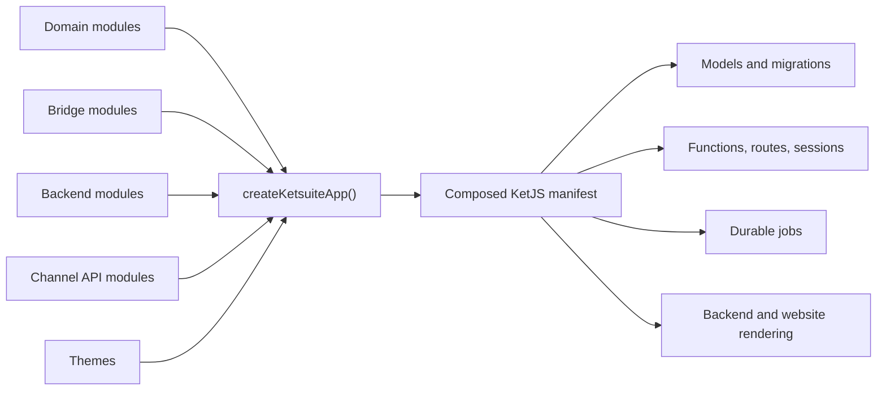

KetSuite is the reference business application built on KetJS. It is both a runnable suite and a set
of composable modules: domain behavior, backend screens, channel APIs, themes, and cross-domain
integrations all use the same public contracts available to a third-party module.

This guide is for developers changing KetSuite or building modules that run beside it. It documents
source boundaries and engineering conventions, not how an operator configures an ERP.

:::caution[Development status]
KetSuite is in the `0.1.x` preview line. Module contracts, package exports, and data models may change
before a stable release. Treat checked-in source and tests as the authority when this guide and a
development branch disagree.
:::

## Repository map

| Path | Responsibility |
| --- | --- |
| `packages/ketsuite/src/app.ts` | Packaged application composition, bootstrap set, worker queues, sessions, and page integration. |
| `packages/ketsuite/src/modules/<name>/` | Domain model, functions, relations, jobs, reports, and messages owned by one module. |
| `packages/ketsuite/src/modules/<name>_backend/` | Trusted admin routes and screens for a domain module. |
| `packages/ketsuite/src/modules/<a>_<b>/` | Integration logic that depends on both domains without coupling either owner to the other. |
| `packages/ketsuite/src/ui/` | Server-rendered backend component kit and its stable TypeScript surface. |
| `packages/ketsuite/src/themes/` | Restricted storefront themes and their assets. |
| `apps/ketsuite/` | Repository application entry used by development and tests. |
| `test/` and `bench/` | Integration, HTTP end-to-end, dialect, contract, and benchmark coverage. |

## Runtime shape

`createKetsuiteApp()` accepts an `OpenStore`, so a deployment may retain the exact same module graph
while selecting a datastore. The packaged default uses SQLite at `.ket/ketsuite.db`; repository
deployments can provide the PostgreSQL store. Vietnamese and `Asia/Ho_Chi_Minh` are the packaged
locale and timezone defaults, not assumptions domain code should hard-code.

## Public package boundaries

Use supported package exports instead of reaching into `src/`:

| Import | Use |
| --- | --- |
| `@ketvietlab/ketsuite` | Published modules, constants, types, Channel API helpers, and selected extension contracts. |
| `@ketvietlab/ketsuite/app` | `createKetsuiteApp()`, `ketsuite`, and `apps`. |
| `@ketvietlab/ketsuite/ui` | Backend UI components without depending on the backend application module. |
| `@ketvietlab/ketsuite/backend` | Backend module plus screen, route, paging, form, and component helpers. |

An internal file becoming convenient to import is not enough reason to deep-import it. Export the
smallest stable contract from the package entry point and cover that contract with a test.

## Choose a development path

- Start with [Local development](/ketsuite/quick-start/) to run and test the repository.
- Read [Application architecture](/ketsuite/architecture/) before changing the app composition.
- Use [Module development](/ketsuite/module-development/) to place domain, backend, and bridge code.
- Use [Backend UI development](/ketsuite/backend-development/) for admin routes, screens, forms, and islands.
- Review [Security and data scope](/ketsuite/security-scope/) before adding an operation or external route.
- Finish with [Testing KetSuite](/ketsuite/testing/) and the relevant business-module guide.

Framework primitives are documented separately. The most relevant references are
[Modules and manifest](/ketjs/modules/), [Models and scopes](/ketjs/models/),
[Functions and effects](/ketjs/functions/), and [Testing](/ketjs/testing/).
