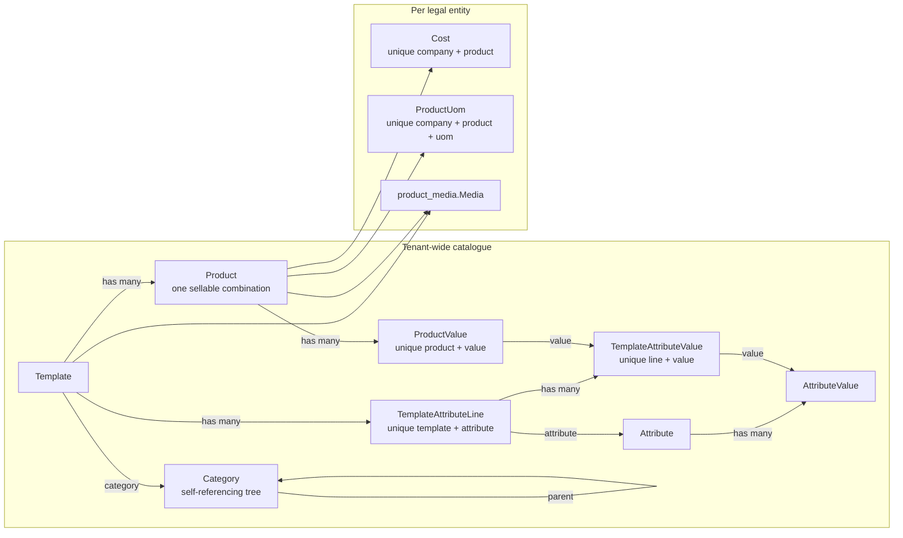

# Product

KetSuite Product is the catalogue every selling and stocking module reads from. It is master data:
one catalogue across the whole tenant, with the values that differ per legal entity — cost and
packaging — kept in company-scoped tables beside it.

## Modules

- `product`: categories, templates, variants, attributes, units of measure per product, and cost.
- `product_media`: ordered images for a template or a variant. Bytes and delivery stay with `storage`.
- `product_backend`: the admin screens and the sidebar entry. Auto-installs once both `product_media`
  and `backend` are present.
- `product_mail_backend`, `product_activity_backend`: chatter and activities on a template.
- `product_variant_mail_backend`, `product_variant_activity_backend`: the same for a variant.

`product` depends only on `uom`. A headless deployment gets the catalogue and its functions with no
admin UI, and installing the admin adds the screens without changing the domain.

## The template and variant split

A `Template` is the thing a person calls a product. A `Product` is one sellable combination of it —
what other systems call a variant. The name reads oddly and is kept deliberately, so the migration
from the domain contract maps one to one.



`ProductValue` is an explicit join rather than a hidden many-to-many: the framework has no magic for
one, and a join you can see is a join you can query, scope and migrate.

## Product type

`Template.type` is `goods` or `service` only.

The domain contract puts three values here — consumable, service, and storable. Storable is a stock
concept, and it would live in a module that must not know stock exists; uninstalling stock would then
leave a value behind that means nothing. KetSuite splits it honestly: `product` says physical or not,
and `stock` extends the template with whether it is tracked. The three original states still map one
to one — service, goods untracked, goods tracked — so a migration is mechanical.

## Company scope

`id` is a tenant-wide primary key, and the engine reads across every company in scope while writing
to exactly one. A company-scoped row therefore carries its company in its id:

| Model | Id | Unique index |
|---|---|---|
| `Cost` | `<company>:<productId>` | `(companyId, productId)` |
| `ProductUom` | `<company>:<productId>:<uomId>` | `(companyId, productId, uomId)` |

A derived id built only from the shared ids would collide between companies on the primary key, and a
lookup that ignores the company finds a row it can never write — the update then filters that row out,
changes nothing, and reports success. Every read of these two models is narrowed to the active company
before it reaches a screen or a write.

## Variants

`generateVariants` takes the cartesian product of the template's attribute lines, skipping attributes
marked `no_variant`. Each generated variant gets a `combinationKey` — the value ids in a stable order —
and an id derived from it, so regenerating is idempotent. Combinations no longer valid are archived
rather than deleted; they may already be on documents.

A variant has no name of its own. It *is* its combination, so the name is derived from the attribute
values rather than stored, and `listVariants` and `getVariant` return it alongside `values`:

```jsonc
// File: examples/product-variant-name.jsonc
{
  "id": "tpl-jacket:color-blue",
  "combinationKey": "color-blue",
  "name": "Xanh nghiệp vụ",
  "values": [{ "attribute": "Màu sắc", "value": "Xanh nghiệp vụ" }]
}
```

`saveVariant` creates one by hand. It only ever writes `combinationKey` on the way in, or when a
caller names it explicitly: casting it on every edit meant setting a barcode on a generated variant
replaced its combination with a manual key and silently unhooked it from its values.

## Units of measure

A template has one default unit. `addProductUom` adds an alternate packaging unit for a variant, and
`setProductUom` replaces the set with at most one — which is what the variant form's single select
means. Both refuse a unit that does not share a root with the template's default, because a conversion
across unit trees has no meaning.

The admin holds the picker to that tree rather than reporting the constraint after a submission: the
unit list is filtered by root, and a unit created from the picker's dialog is parented into the same
tree.

## Media

`product_media.Media` is company-scoped ordered image metadata. Exactly one of `templateId` or
`productId` is set. A unique index on `(companyId, primarySlot)` enforces one primary image per
target in the database rather than in application code.

`listPrimaryMedia` returns the primary image of many targets in one call — a catalogue page shows a
thumbnail per row, and one call per row would be one query per product plus every image none of them
needs.

## Backend screens

`product_backend` owns both the sidebar entry and the pages it points at; a bridge that contributed
only a button would ship a link to a 404.

| Route | Screen |
|---|---|
| `/admin/product/templates` | Catalogue, list and kanban, with search, filters, grouping and saved searches |
| `/admin/product/templates/new` | Create |
| `/admin/product/templates/{id}` | Template detail: general, attributes and variants, images |
| `/admin/product/templates/{id}/variants/{variantId}` | Variant detail |
| `/admin/product/attributes` | Attributes and their values |

Reference fields are relation pickers — a select with a search dialog that can also create the record
it is missing — rather than bare selects. The list functions behind them accept `search` and `limit`,
which is what a picker sends on every keystroke.

Everything the list is doing is in the URL: which page, which search, which view, which columns. The
back button and a shared link keep their meaning, and nothing holds state between requests.

Every mutating route refuses a cross-origin POST, and the two detail screens support a partial save
that replaces the record header and body while chatter, activities and the save controller keep their
DOM and their local state.

## Verification

```bash
# Run from: /path/to/ketjs
npm run build
node --test .build/test/product.test.js \
  .build/test/product-media.test.js \
  .build/test/product-stock.test.js \
  .build/test/product-stock-e2e.test.js
```

`product-stock-e2e.test.ts` boots a real app over HTTP and walks units, variant generation, media
upload and download, pricing and the admin routes. Browser acceptance runs against a seeded fixture
server:

```bash
# Run from: /path/to/ketjs/e2e
npm run test:product
```

The browser suite renders every screen at desktop 1440×900 and mobile 390×844 in both Vietnamese and
English, asserts no horizontal overflow and a consistent control height, and drives create, atomic
save, attribute and variant flows and media management.

## Extension points

`product` contributes no UI and knows nothing about stock, sales or accounting. Other modules reach it
through its functions and through named joints on the admin screens:

- `product_backend:template.media` and `variant.media` for extra image tooling;
- `template.collaboration` and `variant.collaboration`, which the mail and activity bridges fill;
- `template.editor` and `variant.editor` for the progressive save controller;
- `media.upload` for the upload control itself.

`stock` extends the template with storability and tracking through its own configuration function, so
uninstalling it takes its fields and its part of the form with it.
