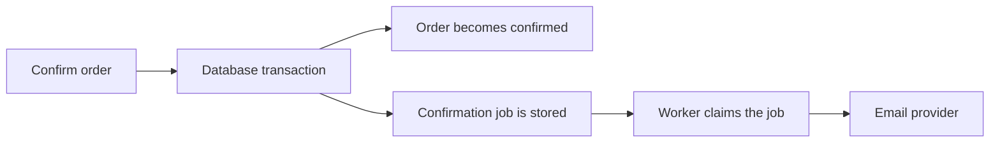

An order is confirmed in the database, then the process crashes before it sends the confirmation email. The order exists, but the work that should follow it does not. Reversing the order is no better: sending the email first can announce an order whose transaction later rolls back.

This gap appears whenever a business write and a background message are committed independently. KetJS jobs address it by storing durable work in the application database and allowing enqueueing to share the business transaction. Redis is not required for that mechanism.

The important qualification is that atomic enqueueing does not make every external action exactly once. **KetJS 0.2.0 Preview** uses an at-least-once delivery model, and handlers must be designed accordingly.

## Commit the intention with the business change

Consider confirming an order and scheduling its email. The database transaction updates the order and inserts the durable job row. If it rolls back, neither change remains. If it commits, a worker can discover the job even if the request process exits immediately afterward.

The diagram contains two different boundaries. The database commit includes the order and job. The provider call happens later and is outside that transaction. Keeping those boundaries visible prevents an application from claiming a guarantee it does not have.

A producer declares the enqueue effect alongside its business effects. Read [durable jobs and workers](/docs/jobs/) for the exact declaration and transactional enqueue APIs.

## A worker is a deployment role

HTTP requests and workers can use the same application contracts while running as separate processes. The worker claims due jobs, holds a lease and executes the declared handler with the appropriate context.

This separation avoids keeping a request open while an export, delivery or other long task finishes. It also means the worker needs the correct deployment composition, tenant resolution and configured resources. “Run a background process” is not enough if that process has a different understanding of the application's contracts.

Use operationally meaningful queues when workloads need different concurrency or treatment. A slow report and a short notification may need different worker settings. Queue names should describe that distinction, not merely mirror every module name.

## A lease makes crashes recoverable

A worker that claims a job is not allowed to own it forever. A lease deadline and heartbeats allow the system to distinguish ongoing work from a process that disappeared.

When a lease expires, another worker can rescue the job. That recovery is useful, but it creates the possibility that some external work was already completed by the original worker. A crash after an email provider accepts a message but before the job is marked completed can cause another delivery attempt.

Retries also occur after failures, up to the declared attempt limit. Job state and preserved error history make those outcomes inspectable. A discarded job is an operational result that requires a decision, not an exception that silently vanishes into a console log.

## Idempotency must describe the business effect

KetJS requires `idempotent: true` for a job declaration because delivery is at least once. The declaration expresses a required handler property; it does not magically make an arbitrary provider call safe to repeat.

Use a stable business idempotency key where the external service supports it. For an order confirmation, the key should identify that confirmation, not a random execution attempt. If the provider lacks deduplication, design a durable application strategy and document the remaining uncertainty.

Job uniqueness and external idempotency are related but different. A unique enqueue key can prevent duplicate intended jobs according to its contract. It cannot prove that the external action was performed only once after a worker crash.

The dangerous test is not “does the handler run?” It is “what happens if the handler runs twice after the provider accepted the first action?” Use that question in a code review.

## Cancellation is cooperative

Job context exposes an abort signal for timeout or shutdown. Long-running work should check it or pass it to APIs that support cancellation.

A timeout cannot rewind an external action that already happened. It also cannot force a CPU-heavy loop that never yields to become well behaved. Design handlers so that work has bounded units and sensible checkpoints.

Large exports may benefit from a resumable design with recorded progress, but that is an application decision rather than an automatic property of every job. Keep partial output and cleanup rules explicit, especially when writing to tenant-namespaced storage.

## Notifications improve latency, not durability

PostgreSQL `LISTEN/NOTIFY` can wake workers sooner. The durable rows, polling and lease mechanism remain the guarantee. Losing a notification must not mean losing a job.

This distinction is useful when debugging. A delayed notification is a latency problem; a missing committed job row is a correctness problem. Measure and inspect them separately instead of treating every slow delivery as data loss.

Similarly, scheduled jobs have their own tick semantics. Do not infer a complete historical replay from a schedule declaration; consult the documented behavior for missed ticks and review whether your domain needs explicit catch-up work.

## Evaluate failure recovery deliberately

Create a job in a transaction that you later roll back and verify that it is absent. Commit another and stop the producer before a worker runs; it should remain discoverable. Then interrupt a worker and examine lease recovery and retry history.

Repeat a handler with the same business key and check the external-effect strategy. Finally, practice inspecting and recovering a discarded job without blindly repeating a dangerous action.

These exercises reveal whether the application can explain its state after a crash. For the performance side of those decisions, continue with [reading benchmarks](/blog/reading-benchmarks/).
