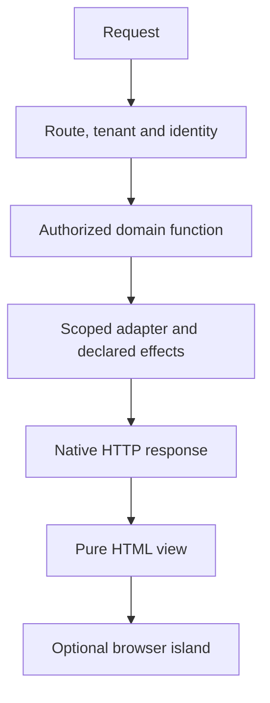

## Before the first request

KetJS resolves the selected deployment's module graph and checks its composed manifest. Routes, functions, models, jobs and presentation contracts come from that same composition. Read [Application composition](/docs/workspaces/) and [Modules](/docs/modules/) first.

## Resolve the request context

The HTTP runtime matches a native route and resolves the request's deployment, tenant and viewer context. Applications with multiple physical tenant databases must choose the tenant before opening tenant-scoped runtime state. Session-backed and externally resolved identities must keep their source explicit.

## Execute declared behavior

A route uses public domain functions under the viewer's permissions. Functions validate input, enforce declared effects and operate on the selected data scope. Business mutations and validation belong here rather than in a presentation island.

## Return a native response

A handler returns the appropriate HTTP response, redirect, stream, form outcome or HTML. Shared views render pure markup. Explicit islands hydrate that markup and own browser state and effects. Native links and forms retain their ordinary fallback behavior.

## Continue by responsibility

Read [HTTP routes](/docs/http/) for routing and responses, [Authorization](/docs/authorization/) for access, [Sessions and tenant isolation](/docs/sessions-tenants/) for identity, and [Rendering and islands](/docs/rendering/) for presentation.
